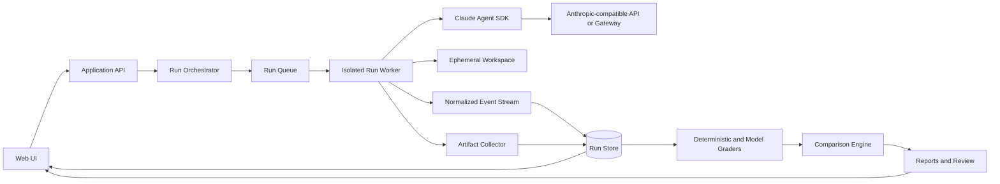

# SkillConsole

<p align="center">
  <strong>The visual workspace for managing, testing, comparing, and reporting Agent Skills.</strong>
</p>

<p align="center">
  Skill registry · Visual test studio · Run history · Trace inspection · Regression analysis · Shareable reports
</p>

> [!IMPORTANT]
> SkillConsole is currently in **pre-alpha**. The product model, configuration schema, and extension APIs may change before the first stable release.

<!--
Add a product screenshot or short demo here once the first UI is available.
A 10–20 second GIF showing “select a Skill → run a suite → inspect a failure → compare versions” will communicate the project better than a static dashboard screenshot.
-->

## What is SkillConsole?

SkillConsole is an open-source, web-based quality workspace for **Agent Skills**.

It gives Skill authors, QA engineers, domain reviewers, AI platform teams, and project owners one place to:

- manage Skills and their versions;
- organize test suites, fixtures, assertions, and review rubrics;
- run Skills through real agent sessions;
- inspect messages, tool calls, files, costs, latency, and failures;
- compare Skill versions, models, endpoints, and execution profiles;
- detect regressions across repeated test runs;
- review results collaboratively and publish reusable test reports.

SkillConsole is not intended to be only a CLI wrapper, chat UI, benchmark leaderboard, or log viewer. Its goal is to make Agent Skill quality **visible, reproducible, reviewable, and reportable**.

## Why SkillConsole?

Agent Skills are filesystem-based instructions, resources, and workflows. They are easy to create, but difficult to evaluate consistently.

A Skill may look correct and still:

- fail to trigger for real user requests;
- trigger for unrelated requests;
- work with one model but regress with another;
- produce the right final text through the wrong or unsafe tool path;
- generate incomplete or invalid artifacts;
- become slower or more expensive after a change;
- pass an automated judge while failing a domain expert's review.

SkillConsole treats a Skill as a versioned, testable product—not just a Markdown file.

## Core capabilities

### Skill registry

- Import Skills from a local directory or Git repository.
- Inspect `SKILL.md`, supporting files, scripts, and referenced resources.
- Track versions, commits, tags, owners, labels, and release status.
- Validate metadata, paths, dependencies, and configuration compatibility.
- Preserve immutable Skill snapshots for reproducible runs.

### Visual test studio

- Create trigger, capability, artifact, safety, and regression test cases.
- Group cases into reusable suites.
- Attach files, repositories, expected outputs, and structured assertions.
- Configure deterministic graders and optional model-based rubrics.
- Run a single case interactively or execute a full suite.

### Run history and trace inspection

- Stream agent output in real time.
- Inspect model messages, Skill activation, tool calls, tool results, and errors.
- Browse generated artifacts and workspace changes.
- Record duration, token usage, cost, retries, and termination reason.
- Search, filter, tag, annotate, and rerun historical executions.

### Compare and regression analysis

Compare any meaningful dimension:

- Skill version A vs. Skill version B;
- candidate vs. baseline without the Skill;
- one model vs. another model;
- one API endpoint vs. another endpoint;
- one execution profile vs. another profile;
- current branch vs. the last release.

SkillConsole should highlight:

- newly failing and newly passing cases;
- trigger precision and recall changes;
- score, latency, cost, and tool-usage deltas;
- output and artifact differences;
- inconsistent or flaky cases across repeated trials.

### Reports and review

- Combine automated grading with human review.
- Assign reviewers and capture comments, decisions, and overrides.
- Generate release, regression, comparison, and executive-summary reports.
- Export or share sanitized HTML, Markdown, JSON, and CI-friendly results.
- Preserve the evidence behind every reported conclusion.

### Environments

> [!IMPORTANT]
> SkillConsole runs agents through the **Claude Agent SDK** and does not integrate with each model vendor through separate built-in provider configurations. Every inference endpoint is user-managed: users supply the endpoint URL, API key (or secure secret reference), and model identifier.
>
> The endpoint must implement the **Anthropic Messages API** contract used by the Claude Agent SDK—principally `POST /v1/messages`, including SSE streaming, `tool_use` / `tool_result` content blocks, stop-reason fields, and usage metadata required by agent runs. An OpenAI-compatible `/v1/chat/completions` endpoint alone cannot be used directly unless a gateway converts it to this contract.

Possible connection paths include:

- the Anthropic API directly;
- an internal enterprise LLM gateway;
- gateway or conversion layers such as [New API](https://docs.newapi.ai/en/docs/apps/claude-code), [LiteLLM](https://docs.litellm.ai/), or [Claude Code Router](https://github.com/musistudio/claude-code-router), when configured to expose the required Messages API behavior;
- a self-hosted protocol translation service;
- any other endpoint that the Claude Agent SDK can call and that satisfies the contract above.

These are connection examples, not bundled integrations or certified compatibility claims. SkillConsole does not determine which provider is behind an endpoint. Protocol translation, model capability, availability, cost, and data handling remain the responsibility of the user or gateway operator.

Protocol references: [Anthropic Messages API](https://platform.claude.com/docs/en/api/messages/create) and [streaming messages](https://platform.claude.com/docs/en/build-with-claude/streaming).

Store reusable execution profiles containing:

- API base URL;
- secret reference;
- custom model name;
- custom headers;
- tool and permission policy;
- system-prompt mode;
- turn, timeout, and budget limits;
- workspace and network isolation settings.

An environment should include a capability check for authentication, streaming, tool use, usage reporting, and other runtime features required by a test suite.

## Runtime model

SkillConsole uses the **Claude Agent SDK** as its initial and primary agent runtime. It does not maintain a separate user-installed Claude CLI runner.

The platform follows Claude Code's filesystem configuration model where practical:

```text
<run-workspace>/
├── CLAUDE.md
└── .claude/
    ├── settings.json
    ├── skills/
    │   └── <skill-name>/
    │       ├── SKILL.md
    │       └── ...
    ├── agents/
    └── commands/
```

For every run, SkillConsole materializes an isolated workspace containing only the selected Skill version, fixtures, and approved project configuration. The Agent SDK discovers project Skills and configuration from that workspace.

Useful references:

- [Claude Agent SDK overview](https://code.claude.com/docs/en/agent-sdk/overview)
- [Agent Skills in the SDK](https://code.claude.com/docs/en/agent-sdk/skills)
- [TypeScript SDK reference](https://code.claude.com/docs/en/agent-sdk/typescript)
- [Claude Code environment variables](https://code.claude.com/docs/en/env-vars)

## Architecture



### Recommended deployment shape

The first release is designed as a modular monolith:

```text
Browser
  └── SkillConsole server
        ├── application API
        ├── Skill and test management
        ├── run orchestration
        ├── comparison and reporting
        ├── SQLite metadata store
        └── isolated per-run worker processes
              └── Claude Agent SDK session
```

Each run executes in its own worker process and workspace. A future hosted edition can move workers into disposable containers without changing the core run protocol.

## Evaluation model

SkillConsole separates evaluation into four layers.

### 1. Static validation

Checks that do not require a model:

- valid frontmatter and required fields;
- missing or unsafe file references;
- invalid paths and undeclared dependencies;
- unsupported configuration;
- potential secret leakage;
- Skill size and structure warnings.

### 2. Trigger evaluation

Measures whether a Skill is selected for the right requests:

- positive cases;
- negative cases;
- hard negatives;
- near-neighbor cases;
- multi-Skill conflicts.

Typical metrics include precision, recall, false-positive rate, false-negative rate, and trigger latency.

### 3. Capability evaluation

Measures whether enabling a Skill improves task completion:

- baseline without the Skill;
- current candidate;
- previous Skill version;
- repeated trials when nondeterminism matters.

Capability evaluation can combine deterministic assertions, artifact validation, pairwise model judging, and human review.

### 4. Regression evaluation

Tracks changes across versions and environments:

- pass-rate movement;
- newly failing cases;
- output-quality movement;
- latency and cost changes;
- tool-use and permission changes;
- flaky or unstable tests.

## Configuration concept

SkillConsole keeps provider connectivity separate from agent execution policy.

### Provider profile

```yaml
name: team-gateway
provider:
  baseUrl: https://llm-gateway.example.com
  apiKeyFrom: env:SKILLCONSOLE_API_KEY
  model: team-claude-compatible-model
  headers:
    X-Workspace: agent-platform
```

The endpoint must be compatible with the Anthropic Messages API behavior required by the Claude Agent SDK. A basic chat response alone does not guarantee support for streaming, tool use, or usage metadata.

### Execution profile

```yaml
name: workspace-write
execution:
  systemPrompt: claude-code-compatible
  settingSources:
    - project
  tools:
    - Skill
    - Read
    - Glob
    - Grep
    - Write
    - Edit
  permissionMode: default
  maxTurns: 20
  timeoutSeconds: 300
  maxBudgetUsd: 2
  network: disabled
```

Secrets must be referenced from environment variables or a secret store. They should never be stored in a Skill snapshot, test definition, run event, exported report, or browser-local storage.

## Example workflow

1. **Add a Skill** from a directory or Git revision.
2. **Create a test suite** with prompts, fixtures, assertions, and rubrics.
3. **Select an environment** containing the endpoint, model, and execution policy.
4. **Run the suite** and inspect live agent activity.
5. **Review failures** using the trace, artifacts, and grader evidence.
6. **Compare versions** or execution environments.
7. **Publish a report** for a release decision, regression review, or stakeholder update.

## Planned data model

```text
Project
├── Skills
│   └── Skill versions
├── Test suites
│   └── Test cases
├── Environments
├── Runs
│   ├── Events
│   ├── Artifacts
│   ├── Grades
│   └── Reviews
├── Comparisons
└── Reports
```

Every run should record enough information to reproduce or explain its result, including:

- Skill content hash;
- test-case and fixture hash;
- model and endpoint profile;
- Agent SDK and application versions;
- execution and permission profile;
- environment and isolation metadata;
- normalized event log;
- generated artifacts;
- grader configuration and evidence.

## Project status and roadmap

SkillConsole is being designed in public. The initial roadmap is intentionally focused on a reliable single-node experience before hosted collaboration features.

### Phase 1 — Local visual workbench

- [ ] Skill import and registry
- [ ] `SKILL.md` inspection and static validation
- [ ] Environment profiles for API key, API URL, and custom model
- [ ] Claude Agent SDK run worker
- [ ] Real-time event and tool-call viewer
- [ ] Artifact browser
- [ ] Test suites and deterministic assertions
- [ ] Run history with SQLite and immutable event logs

### Phase 2 — Evaluation and regression

- [ ] Baseline and candidate runs
- [ ] Skill-version comparison
- [ ] Model and endpoint comparison
- [ ] Repeated trials and flaky-test detection
- [ ] Trigger-evaluation metrics
- [ ] Pairwise model judge
- [ ] Human review workflow
- [ ] Shareable HTML and Markdown reports

### Phase 3 — Team and CI workflows

- [ ] Authentication and project roles
- [ ] Reviewer assignment and approval gates
- [ ] GitHub pull-request integration
- [ ] CI result formats and quality gates
- [ ] Remote workers and container isolation
- [ ] Report history and quality trends
- [ ] Plugin APIs for graders, artifact viewers, and runtime adapters

## Security model

Agent Skills can instruct an agent to read files, write files, run tools, or interact with external systems. SkillConsole therefore treats every run as potentially unsafe.

The intended security model includes:

- one process and workspace per run;
- least-privilege tool policies;
- explicit filesystem boundaries;
- network disabled by default;
- secret injection only inside the run worker;
- event and report redaction;
- execution time, budget, and resource limits;
- disposable container workers for untrusted Skills or multi-tenant hosting.

Until container isolation and permission controls are implemented and audited, do not use SkillConsole to execute untrusted Skills or expose production credentials.

## Design principles

1. **Visual first, automation ready.** The Web UI is the primary workspace, while every run and report remains machine-readable.
2. **Evidence over scores.** A grade must link back to traces, assertions, artifacts, and reviewer evidence.
3. **Reproducibility by default.** Skill versions, fixtures, environments, and evaluation settings are immutable inputs to a run.
4. **Deterministic before probabilistic.** Use code-based assertions whenever possible; use model judges only where judgment is genuinely required.
5. **Comparison is a first-class workflow.** Quality is easier to understand as a delta than as an isolated score.
6. **Claude-compatible, not machine-dependent.** Preserve Claude Code's project configuration model without inheriting uncontrolled user-machine state.
7. **Safe local defaults.** Minimize permissions, network access, and secret exposure.
8. **Open formats.** Runs, events, grades, and reports should remain inspectable outside SkillConsole.

## Development

The initial implementation is expected to use a TypeScript monorepo:

```text
apps/
├── web/                 # React visual workspace
├── server/              # API, orchestration, reports
└── worker/              # isolated Agent SDK execution

packages/
├── core/                # domain model and use cases
├── protocol/            # versioned run-event schemas
├── skill-parser/        # Skill discovery and validation
├── agent-runtime/       # Claude Agent SDK adapter
├── graders/             # deterministic and model graders
├── storage/             # SQLite and artifact storage
├── reporters/           # HTML, Markdown, JSON, CI formats
└── testkit/             # fixtures and integration helpers
```

Proposed local commands:

```bash
pnpm install
pnpm dev
pnpm test
pnpm lint
pnpm typecheck
```

These commands are part of the target repository contract and may change while the initial scaffold is being created.

## Contributing

The project is in its earliest stage, so high-value contributions include:

- real Skill testing workflows and failure cases;
- UX feedback from Skill authors, QA engineers, and domain reviewers;
- evaluation-schema proposals;
- deterministic grader ideas;
- secure worker and sandbox designs;
- sample Skills and reproducible test suites;
- accessibility and report-design feedback.

Before opening a large implementation pull request, start with an issue or design proposal so that the public data model and run protocol remain coherent.

## Non-goals for the first release

- Rebuilding a general-purpose multi-model agent framework.
- Replacing Claude Agent SDK's agent loop.
- Acting as a marketplace for downloading arbitrary Skills.
- Running untrusted Skills without process and filesystem isolation.
- Using a single opaque LLM score as the definition of quality.
- Building a hosted SaaS before the local workflow is reliable.

## License and third-party notices

SkillConsole's original source code and documentation are released under the [MIT License](./LICENSE).

The MIT License applies only to material owned by the SkillConsole copyright holder. It does not relicense third-party SDKs, libraries, APIs, services, models, documentation, or trademarks. Each third-party component remains subject to its own copyright, license, terms of service, and other applicable policies.

### Claude Agent SDK

SkillConsole uses the TypeScript package [`@anthropic-ai/claude-agent-sdk`](https://github.com/anthropics/claude-agent-sdk-typescript). Its repository currently states **© Anthropic PBC. All rights reserved**, and specifies that use is subject to Anthropic's [Commercial Terms of Service](https://www.anthropic.com/legal/commercial-terms), except where a specific component or dependency has a separate license.

Before using, distributing, deploying, or offering SkillConsole to customers or end users, review the current [Claude Agent SDK license and terms](https://github.com/anthropics/claude-agent-sdk-typescript/blob/main/LICENSE.md) and the licenses or terms of all other third-party components. SkillConsole's MIT License does not grant rights to the Claude Agent SDK, Claude Code, Anthropic models or services, or third-party trademarks.

## Acknowledgements

SkillConsole is designed around the Claude Agent SDK and the filesystem-based Agent Skill model used by Claude Code. It is an independent open-source project and is not an official Anthropic product.

---

<p align="center">
  <strong>Manage the Skill. Test the behavior. Explain the result.</strong>
</p>
