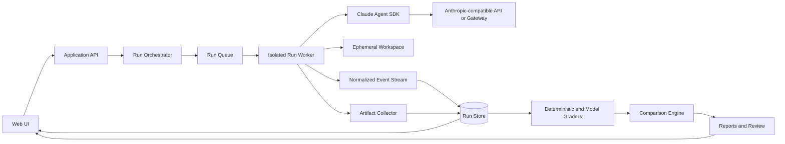

# SkillConsole

[English](./README.md) | **简体中文**

<p align="center">
  <strong>面向 Agent Skills 的可视化管理、测试、对比与报告工作台。</strong>
</p>

<p align="center">
  Skill 管理 · 可视化测试 · 运行历史 · Trace 分析 · 回归对比 · 测试报告
</p>

> [!IMPORTANT]
> SkillConsole 当前处于 **Pre-alpha** 阶段。首个稳定版本发布前，产品模型、配置格式和扩展接口都可能调整。

<!--
首个 UI 可用后，在这里添加产品截图或 10–20 秒演示 GIF。
最推荐的演示路径：选择 Skill → 运行测试集 → 查看失败 Trace → 对比两个版本。
-->

## SkillConsole 是什么？

SkillConsole 是一个面向 **Agent Skills** 的开源 Web 可视化质量工作台。

它为 Skill 作者、测试工程师、领域审核人员、AI 平台团队和项目负责人提供统一入口，用于：

- 管理 Skill 及其版本；
- 管理测试集、测试用例、Fixtures、断言和审核标准；
- 通过真实 Agent Session 执行 Skill；
- 查看消息、工具调用、文件、费用、耗时和错误；
- 对比不同 Skill 版本、模型、API 服务和执行策略；
- 通过重复测试识别回归和不稳定问题；
- 完成人工 Review，并生成可复用、可分享的测试报告。

SkillConsole 不只是 CLI 的 Web 外壳，也不只是聊天页面、Benchmark 排行榜或日志查看器。它的目标是让 Agent Skill 的质量变得**可见、可复现、可审核、可汇报**。

## 为什么需要 SkillConsole？

Agent Skill 通常由文件系统中的指令、资源和工作流组成。创建一个 Skill 很容易，但持续、稳定地判断它是否真正有效却很困难。

一个看起来正确的 Skill，仍然可能：

- 面对真实用户请求时没有触发；
- 在无关请求中误触发；
- 在某个模型上工作正常，换模型后出现回归；
- 最终文字看似正确，但工具调用路径错误或不安全；
- 生成的文件不完整、格式错误或无法使用；
- 修改后延迟或费用明显上升；
- 通过自动评分，却无法通过领域专家审核。

SkillConsole 将 Skill 视为一个有版本、可测试、可发布的产品，而不仅仅是一份 Markdown 文件。

## 核心能力

### Skill 管理

- 从本地目录或 Git 仓库导入 Skill；
- 查看 `SKILL.md`、Supporting Files、脚本和引用资源；
- 管理版本、Commit、标签、负责人和发布状态；
- 校验元数据、路径、依赖和配置兼容性；
- 为每次测试保存不可变的 Skill 快照。

### 可视化测试工作台

- 创建触发、能力、产物、安全和回归测试；
- 将测试用例组织为可复用的测试集；
- 附加文件、仓库、预期产物和结构化断言；
- 配置确定性 Grader 和可选的模型评分 Rubric；
- 交互式运行单条用例，或批量运行完整测试集。

### 运行历史与 Trace 分析

- 实时查看 Agent 输出；
- 查看模型消息、Skill 激活、工具调用、工具结果和错误；
- 浏览生成产物与工作目录变更；
- 记录耗时、Token、费用、重试和终止原因；
- 对历史运行进行搜索、筛选、标记、备注和重跑。

### 对比与回归分析

支持对比：

- Skill 版本 A 与版本 B；
- Candidate 与不加载 Skill 的 Baseline；
- 不同模型；
- 不同 API Endpoint；
- 不同执行策略；
- 当前分支与上一个发布版本。

重点展示：

- 新增失败和新增通过的测试；
- 触发 Precision、Recall 的变化；
- 分数、耗时、费用和工具使用差异；
- 文本输出与文件产物差异；
- 多次运行中不稳定、容易波动的测试。

### 报告与人工审核

- 结合自动评分和人工 Review；
- 分配审核人员，保存评论、结论和人工覆盖结果；
- 生成发布、回归、对比和管理汇报报告；
- 导出或分享脱敏后的 HTML、Markdown、JSON 和 CI 结果；
- 保留每一个结论背后的 Trace、断言、产物和审核证据。

### 运行环境

> [!IMPORTANT]
> SkillConsole 使用 **Claude Agent SDK** 运行 Agent，不针对不同模型厂商提供独立的内置 Provider 配置。所有推理 Endpoint 都由用户自行管理：用户需要填写 Endpoint URL、API Key（或安全的 Secret 引用）和模型标识。
>
> Endpoint 必须实现 Claude Agent SDK 所需的 **Anthropic Messages API** 契约，主要接口为 `POST /v1/messages`，并支持 Agent 运行所需的 SSE 流式事件、`tool_use` / `tool_result` 内容块、停止原因字段和 Usage Metadata。只有 OpenAI 兼容的 `/v1/chat/completions` 接口并不能直接使用，必须先通过网关转换为上述契约。

用户可以选择的接入方式包括：

- 直接使用 Anthropic 官方 API；
- 使用企业内部 LLM 网关；
- 使用 [New API](https://docs.newapi.ai/zh/docs/apps/claude-code)、[LiteLLM](https://docs.litellm.ai/) 或 [Claude Code Router](https://github.com/musistudio/claude-code-router) 等网关或协议转换层，并将其配置为提供所需的 Messages API 行为；
- 使用自建的协议转换服务；
- 使用其他能够被 Claude Agent SDK 调用并满足上述契约的 Endpoint。

以上只是可选接入方式示例，不代表 SkillConsole 内置集成、认证兼容或为其背书。SkillConsole 不判断 Endpoint 背后实际使用哪一家模型厂商；协议转换、模型能力、服务可用性、费用和数据处理均由用户或网关运营方负责。

协议参考：[Anthropic Messages API](https://platform.claude.com/docs/en/api/messages/create) 与 [Streaming Messages](https://platform.claude.com/docs/en/build-with-claude/streaming)。

可复用的 Environment Profile 可以包含：

- API Base URL；
- Secret 引用；
- 自定义模型名称；
- 自定义 Headers；
- 工具和权限策略；
- System Prompt 模式；
- 最大轮数、超时和预算；
- 工作目录与网络隔离设置。

每个环境应提供能力检测，验证认证、流式输出、Tool Use、Usage Metadata 等测试所需能力是否可用。

## Runtime 设计

SkillConsole 首期只使用 **Claude Agent SDK** 作为 Agent Runtime，不再单独维护“调用用户本机 Claude CLI”的 Runner。

平台在适用范围内沿用 Claude Code 的文件系统配置模型：

```text
<run-workspace>/
├── CLAUDE.md
└── .claude/
    ├── settings.json
    ├── skills/
    │   └── <skill-name>/
    │       ├── SKILL.md
    │       └── ...
    ├── agents/
    └── commands/
```

每次运行时，SkillConsole 都会创建独立工作目录，只放入本次测试选中的 Skill 版本、Fixtures 和允许使用的项目配置。Agent SDK 从该工作目录发现项目级 Skill 和配置。

相关资料：

- [Claude Agent SDK Overview](https://code.claude.com/docs/en/agent-sdk/overview)
- [Agent Skills in the SDK](https://code.claude.com/docs/en/agent-sdk/skills)
- [TypeScript SDK Reference](https://code.claude.com/docs/en/agent-sdk/typescript)
- [Claude Code Environment Variables](https://code.claude.com/docs/en/env-vars)

## 架构



### 推荐部署形态

首个版本采用模块化单体：

```text
Browser
  └── SkillConsole Server
        ├── Application API
        ├── Skill 与测试管理
        ├── Run 编排
        ├── 对比和报告
        ├── PostgreSQL 元数据与事件存储
        └── 每次运行独立的 Worker Process
              └── Claude Agent SDK Session
```

每次 Run 都在独立进程和独立工作目录中执行。未来托管版本可以将 Worker 迁移到一次性容器，而不改变核心 Run Protocol。

## 评测模型

SkillConsole 将评测拆成四层。

### 1. 静态校验

不调用模型即可完成：

- Frontmatter 和必填字段校验；
- 缺失或不安全的文件引用；
- 非法路径和未声明依赖；
- 不支持的配置；
- 潜在 Secret 泄漏；
- Skill 体积与结构告警。

### 2. 触发评测

判断 Skill 是否在正确的请求中被选择：

- 正样本；
- 负样本；
- Hard Negatives；
- 相近意图；
- 多 Skill 冲突场景。

典型指标包括 Precision、Recall、False-positive Rate、False-negative Rate 和 Trigger Latency。

### 3. 能力评测

判断启用 Skill 后是否真正改善任务完成质量：

- 不加载 Skill 的 Baseline；
- 当前 Candidate；
- 上一个 Skill 版本；
- 在需要时执行多次 Trial。

能力评测可以组合确定性断言、产物校验、模型盲评和人工 Review。

### 4. 回归评测

持续跟踪版本和环境变化：

- Pass Rate 变化；
- 新增失败用例；
- 输出质量变化；
- 延迟和费用变化；
- Tool Use 和权限变化；
- Flaky Test 和不稳定测试。

## 配置模型

SkillConsole 将 Provider 连接配置与 Agent 执行策略分开管理。

### Provider Profile

```yaml
name: team-gateway
provider:
  baseUrl: https://llm-gateway.example.com
  apiKeyFrom: env:SKILLCONSOLE_API_KEY
  model: team-claude-compatible-model
  headers:
    X-Workspace: agent-platform
```

目标 Endpoint 必须兼容 Claude Agent SDK 所需的 Anthropic Messages API 行为。仅能完成普通聊天请求，并不代表一定支持 Streaming、Tool Use 或 Usage Metadata。

### Execution Profile

```yaml
name: workspace-write
execution:
  systemPrompt: claude-code-compatible
  settingSources:
    - project
  tools:
    - Skill
    - Read
    - Glob
    - Grep
    - Write
    - Edit
  permissionMode: default
  maxTurns: 20
  timeoutSeconds: 300
  maxBudgetUsd: 2
  network: disabled
```

Secret 必须来自环境变量或 Secret Store。不得将 Secret 保存到 Skill 快照、测试定义、运行事件、导出报告或浏览器 Local Storage 中。

## 典型使用流程

1. **添加 Skill**：从目录或 Git Revision 导入；
2. **创建测试集**：配置 Prompt、Fixture、断言和 Rubric；
3. **选择运行环境**：指定 Endpoint、模型和执行策略；
4. **执行测试**：实时查看 Agent 行为；
5. **审核失败**：结合 Trace、产物和 Grader 证据定位问题；
6. **进行对比**：比较 Skill 版本或运行环境；
7. **发布报告**：用于发布决策、回归 Review 或项目汇报。

## 计划中的数据模型

```text
Project
├── Skills
│   └── Skill Versions
├── Test Suites
│   └── Test Cases
├── Environments
├── Runs
│   ├── Events
│   ├── Artifacts
│   ├── Grades
│   └── Reviews
├── Comparisons
└── Reports
```

每次 Run 都应保存足够的信息，用于复现或解释结果：

- Skill 内容 Hash；
- 测试用例和 Fixture Hash；
- 模型与 Endpoint Profile；
- Agent SDK 与应用版本；
- 执行和权限策略；
- 环境与隔离信息；
- 标准化事件日志；
- 生成产物；
- Grader 配置和评分证据。

## 项目状态与路线图

SkillConsole 将公开进行设计和开发。初期优先确保单机版本可靠，再扩展团队协作和托管能力。

### Phase 1 — 本地可视化工作台

- [ ] Skill 导入和管理
- [ ] `SKILL.md` 查看与静态校验
- [ ] API Key、API URL 和自定义模型环境配置
- [ ] Claude Agent SDK Run Worker
- [ ] 实时事件和工具调用查看器
- [ ] 产物浏览器
- [ ] 测试集与确定性断言
- [ ] PostgreSQL 运行历史与不可变事件日志

### Phase 2 — 评测与回归

- [ ] Baseline 与 Candidate 运行
- [ ] Skill 版本对比
- [ ] 模型和 Endpoint 对比
- [ ] 重复 Trial 与 Flaky Test 检测
- [ ] Trigger Evaluation 指标
- [ ] Pairwise Model Judge
- [ ] 人工 Review 工作流
- [ ] 可分享的 HTML 和 Markdown 报告

### Phase 3 — 团队与 CI

- [ ] 登录、项目角色和权限
- [ ] Reviewer 分配与审批 Gate
- [ ] GitHub Pull Request 集成
- [ ] CI 结果格式和质量门禁
- [ ] 远程 Worker 与容器隔离
- [ ] 报告历史和质量趋势
- [ ] Grader、Artifact Viewer 和 Runtime Adapter 插件接口

## 安全模型

Agent Skill 可能引导 Agent 读取文件、写入文件、调用工具或访问外部系统，因此 SkillConsole 将每次运行都视为潜在不安全操作。

目标安全模型包括：

- 每次 Run 使用独立进程和工作目录；
- 最小权限工具策略；
- 明确的文件系统边界；
- 默认关闭网络；
- Secret 只注入 Run Worker；
- 事件和报告自动脱敏；
- 时间、预算和资源上限；
- 面向不可信 Skill 或多租户部署的一次性容器 Worker。

在容器隔离和权限控制完成并经过审计之前，不应使用 SkillConsole 执行不可信 Skill，也不应暴露生产环境凭据。

## 设计原则

1. **可视化优先，自动化就绪。** Web 是主要工作台，但 Run 和 Report 必须保持机器可读。
2. **证据优先于分数。** 每一个评分都应能够回溯到 Trace、断言、产物和人工审核证据。
3. **默认可复现。** Skill、Fixture、Environment 和评测参数都是 Run 的不可变输入。
4. **先确定性，后概率性。** 可以用代码判断的内容优先使用代码；只有真正需要判断力的部分才使用模型评分。
5. **对比是一等工作流。** 质量变化通常比孤立分数更容易理解和决策。
6. **兼容 Claude 配置，不依赖宿主机状态。** 保留 Claude Code 的项目配置模型，但不继承不可控的用户机器配置。
7. **安全的本地默认值。** 尽量减少权限、网络访问和 Secret 暴露。
8. **开放数据格式。** 即使脱离 SkillConsole，也能查看和处理 Run、Event、Grade 和 Report。

## 开发与部署

SkillConsole 的开发和生产部署统一使用 Docker。贡献者不需要在宿主机安装 Node.js 依赖，npm Workspaces 和 `node_modules` 都在镜像中构建。

环境要求：

- Windows 或 macOS 使用 Docker Desktop，Linux 使用 Docker Engine 和 Docker Compose；
- 开发环境需要使用 `5173`、`3000` 和 `5433` 端口；
- 生产环境需要使用 `3000` 端口。

容器内部使用 npm TypeScript Monorepo。根目录 `package.json` 中的 `workspaces` 定义 Workspace，`package-lock.json` 锁定依赖，二者都是可复现构建所需的元数据。

### 镜像仓库配置

项目默认使用 Docker Hub。如需使用镜像站，请将 `.env.example` 复制为 `.env`，并填写包含末尾斜杠的镜像前缀：

```dotenv
DOCKER_REGISTRY=docker.1ms.run/
```

该前缀会应用于 PostgreSQL、Node.js、Dockerfile Frontend 和独立 Web 构建使用的 Nginx 镜像。将 `DOCKER_REGISTRY` 留空时使用 Docker Hub。PowerShell 当前会话中的环境变量会覆盖 `.env` 中的配置：

```powershell
$env:DOCKER_REGISTRY = "docker.1ms.run/"
```

第三方镜像站为可选配置，并非由 SkillConsole 运营或验证；其可用性、内容完整性与供应链安全由使用者自行评估。

### 开发环境

在仓库根目录执行：

```bash
docker compose -f compose.yaml -f compose.development.yaml --profile development up --build
```

容器健康后打开：

```text
http://localhost:5173
```

开发 Profile 会启动：

- `http://localhost:5173`：Vite 前端；
- `http://localhost:3000`：Fastify API；
- `127.0.0.1:5433` 及 Compose 内部网络中的 PostgreSQL。

API 的进程存活探针为 `http://localhost:3000/health/live`，包含 PostgreSQL 检查的就绪探针为 `http://localhost:3000/health/ready`，仅开发环境开放的 OpenAPI 文档为 `http://localhost:3000/documentation`。Compose 会在启动 Fastify 前先执行尚未应用的 Drizzle 迁移。

Vite 会把 `/api/*` 代理到 Fastify。源码目录通过 Bind Mount 实现热更新，依赖始终保留在 Docker 内，不会在宿主机生成 `node_modules`。

本地数据库客户端可使用以下信息连接：

```text
主机：127.0.0.1
端口：5433
数据库：skillconsole
用户名：skillconsole
密码：.env 中的 POSTGRES_PASSWORD，未配置时默认为 skillconsole
```

如果本机的 `5433` 端口已被占用，可在 `.env` 中指定其他宿主机端口，例如：

```dotenv
POSTGRES_HOST_PORT=15432
```

宿主机端口映射只定义在 `compose.development.yaml` 中，生产环境启动命令不会向宿主机暴露 PostgreSQL。

停止环境：

```bash
docker compose -f compose.yaml -f compose.development.yaml --profile development down
```

修改 `package.json` 或 `package-lock.json` 后，需要重新执行带 `--build` 的开发命令。

### 生产部署

先将 `.env.example` 复制为 `.env`，并在对外部署前修改 `POSTGRES_PASSWORD`，然后执行：

```bash
docker compose --profile production up --build --detach
```

生产环境只需要打开：

```text
http://localhost:3000
```

生产镜像会构建 React 前端，通过 Fastify 提供静态页面，并在 `/api/*` 提供接口。PostgreSQL 和应用运行数据使用 Docker Volume 持久化。

常用运维命令：

```bash
docker compose --profile production logs --follow
docker compose --profile production ps
docker compose --profile production down
```

应用结构如下：

```text
apps/
├── web/                 # React 可视化工作台
└── server/              # 全部后端能力与包内 Run Worker

apps/server/src/
├── config/              # 类型化运行配置
├── core/                # Server 内错误与 HTTP 基础类型
├── infrastructure/      # PostgreSQL、Drizzle、文件存储和日志
└── modules/             # Project、Skill、Test、Environment 和 Run
```

完整目录职责、内部结构和依赖方向见 [项目结构设计](./docs/project-structure.md)，产品与 Runtime 边界见 [系统架构设计](./docs/system-architecture-design.md)。

## 参与贡献

项目还处于最早期阶段，当前最有价值的贡献包括：

- 真实的 Skill 测试流程和失败案例；
- 来自 Skill 作者、测试工程师和领域审核人员的 UX 反馈；
- Evaluation Schema 设计建议；
- 确定性 Grader 方案；
- 安全 Worker 与 Sandbox 设计；
- 示例 Skill 和可复现测试集；
- 无障碍和报告设计反馈。

在提交大型实现 PR 前，建议先创建 Issue 或 Design Proposal，以确保公开数据模型和 Run Protocol 保持一致。

## 首个版本暂不解决的问题

- 重建一个通用的多模型 Agent Framework；
- 替代 Claude Agent SDK 的 Agent Loop；
- 建设任意 Skill 下载市场；
- 在没有进程和文件系统隔离的情况下执行不可信 Skill；
- 用一个不可解释的 LLM 总分定义质量；
- 在本地工作流尚不可靠时优先建设 SaaS。

## 许可证与第三方声明

SkillConsole 项目自身的原创源代码与文档采用 [MIT License](./LICENSE)。

MIT License 仅适用于 SkillConsole 著作权人拥有权利的内容，不会对第三方 SDK、依赖库、API、服务、模型、文档或商标进行重新授权。每项第三方组件仍分别受其自身著作权、许可证、服务条款及其他适用政策约束。

### Claude Agent SDK

SkillConsole 使用 TypeScript 包 [`@anthropic-ai/claude-agent-sdk`](https://github.com/anthropics/claude-agent-sdk-typescript)。该项目仓库当前标注 **© Anthropic PBC. All rights reserved**，并说明除具有独立许可证的特定组件或依赖项外，其使用受 Anthropic [Commercial Terms of Service](https://www.anthropic.com/legal/commercial-terms) 约束。

在使用、分发、部署 SkillConsole，或将其作为产品和服务提供给客户或最终用户之前，请自行查阅最新的 [Claude Agent SDK 许可证与条款](https://github.com/anthropics/claude-agent-sdk-typescript/blob/main/LICENSE.md)，以及其他所有第三方组件各自的许可证或条款。SkillConsole 的 MIT License 不授予 Claude Agent SDK、Claude Code、Anthropic 模型或服务以及第三方商标的相关权利。

## 致谢与声明

SkillConsole 围绕 Claude Agent SDK 和 Claude Code 使用的文件系统 Agent Skill 模型设计。SkillConsole 是独立开源项目，并非 Anthropic 官方产品。

---

<p align="center">
  <strong>管理 Skill，测试行为，解释结果。</strong>
</p>
