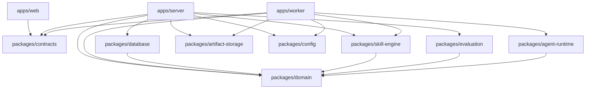

# SkillConsole 项目结构设计

> 文档状态：已确认的目录骨架
>
> 适用阶段：v0.1 开发准备
>
> 更新日期：2026-07-23

## 1. 设计目标

SkillConsole 采用 TypeScript Monorepo，将 Web 界面、Fastify Server、Agent Run Worker 和可复用领域能力分开。

目录结构需要同时满足：

1. 前端不能直接接触数据库、文件系统、Secret 或 Claude Agent SDK；
2. HTTP API 与 Agent 执行进程分离；
3. 产品模块可以在模块化单体中独立演进；
4. PostgreSQL、Artifact Store 和 Claude Agent SDK 可以通过明确边界替换或升级；
5. 首版不因未来可能出现的 SaaS、多 Runtime 或微服务需求而提前复杂化；
6. 每个目录都能够从 README 中判断职责、允许依赖和禁止行为。

## 2. 技术基线

| 领域 | 选择 | 说明 |
| --- | --- | --- |
| 语言 | TypeScript | 前端、Server、Worker 和共享包统一语言 |
| Node.js | `>=22.12.0` | 兼容当前本地 Node.js 22；CI 后续以 Node.js 24 LTS 为主 |
| 包管理 | pnpm 11 | 使用 pnpm Workspace，不在首版加入 Turborepo |
| 前端 | React 19 + Vite 8 + shadcn/ui + Tailwind CSS 4 | 独立 SPA，通过 API 和 SSE 与 Server 通信 |
| 前端数据层 | TanStack Query + TanStack Table | 管理服务端状态和数据密集型表格 |
| 后端 | Fastify 5 | 使用插件封装和按产品模块组织 Route |
| API Schema | TypeBox / JSON Schema | 用于运行时校验、类型推导和 OpenAPI |
| 数据库 | PostgreSQL | 保存结构化元数据、Run 状态、事件和断言结果 |
| 数据访问 | Drizzle ORM + `pg` | Schema 使用 TypeScript 定义，SQL Migration 纳入版本控制 |
| 实时事件 | Server-Sent Events | Server 向 Web 单向推送 Run 事件 |
| Agent Runtime | Claude Agent SDK for TypeScript | 只在 `packages/agent-runtime` 内直接依赖 |
| Artifact | 本地文件系统 | PostgreSQL 只保存元数据和受控引用 |
| 日志 | Pino | Server 与 Worker 使用同一个 `runId` 关联日志 |

当前仓库已初始化前端工程基础，包括依赖、Vite 与 TypeScript 配置、Tailwind CSS 主题入口、shadcn/ui 配置和最小启动入口。Server、Worker 和共享包仍保持目录骨架状态。

## 3. 仓库目录

```text
SkillConsole/
├── Dockerfile                    # Web + Server 生产镜像
├── compose.yaml                  # 开发与生产 Profile
├── apps/
│   ├── web/                    # React 可视化工作台和 Web Dockerfile
│   ├── server/                 # Fastify API、静态托管和 Server Dockerfile
│   └── worker/                 # 独立 Agent Run 进程
│
├── packages/
│   ├── contracts/              # REST、SSE、IPC 和 Run Event Schema
│   ├── domain/                 # 产品领域模型和状态规则
│   ├── database/               # PostgreSQL、Drizzle Schema 与 Migration
│   ├── skill-engine/           # Skill 扫描、校验、快照和 Workspace
│   ├── agent-runtime/          # Claude Agent SDK Adapter
│   ├── evaluation/             # 确定性断言
│   ├── artifact-storage/       # Artifact 存储接口和本地实现
│   ├── config/                 # 类型化环境配置
│   └── testkit/                # 测试 Builder、Fixture 和 Mock
│
├── examples/
│   ├── skills/                 # 可公开的示例 Skill
│   └── test-projects/          # 示例测试项目
│
├── infra/
│   └── docker/                 # PostgreSQL 本地开发设施
│
├── docs/
│   ├── architecture/           # 聚焦的架构说明
│   ├── decisions/              # Architecture Decision Records
│   ├── project-structure.md
│   └── system-architecture-design.md
│
├── scripts/                    # 可重复的仓库级脚本
├── var/                        # 运行时数据，不纳入 Git
├── package.json
├── pnpm-workspace.yaml
└── tsconfig.base.json
```

`var/` 不在仓库中创建占位文件。应用首次运行时按需创建，并由 `.gitignore` 排除。

## 4. 应用目录

### 4.1 `apps/web`

React 和 Vite 构建的浏览器应用。

负责：

- 项目、Skill、测试、运行环境、Run 和结果页面；
- 表单与本地交互状态；
- 调用版本化 REST API；
- 订阅 SSE Run 事件；
- 展示 Trace、断言和 Artifact。

不负责：

- 读取本机 Skill 目录；
- 解析 Secret；
- 访问 PostgreSQL；
- 启动 Worker；
- 调用 Claude Agent SDK。

建议的内部结构：

```text
apps/web/src/
├── app/                         # Provider、Router、应用壳和全局错误边界
│   ├── layouts/
│   ├── providers/
│   └── router/
├── locales/                      # 按 Locale 和 Namespace 划分的 JSON 文案
├── routes/                      # 路由级页面
├── features/
│   ├── workbench-home/
│   ├── project-overview/
│   ├── skill-inspector/
│   ├── test-cases/
│   ├── test-case-editor/
│   ├── environment/
│   ├── run-console/
│   └── run-result/
├── shared/
│   ├── api/
│   ├── components/
│   │   ├── layout/
│   │   └── ui/
│   ├── config/
│   ├── hooks/
│   ├── i18n/                    # i18next 初始化与语言定义
│   ├── lib/
│   ├── stores/                  # Zustand 客户端偏好状态
│   └── types/
├── styles/
├── test/
└── main.tsx
```

依赖方向固定为 `app → routes → features → shared`。`features` 以产品能力划分，不使用全局 `components/` 堆放所有页面组件；跨业务复用的布局、shadcn/ui 组件、Hooks 和工具进入 `shared`。

### 4.2 `apps/server`

Fastify 模块化单体，是 Web、PostgreSQL、Artifact Store 和 Worker 之间的应用层。

负责：

- Fastify 生命周期、插件和 Route；
- API 输入输出校验；
- OpenAPI；
- 产品 Use Case；
- PostgreSQL 事务；
- Run Input Snapshot；
- Worker 生命周期和 Run 调度；
- SSE 事件发布；
- 结果汇总和错误映射。

建议的内部结构：

```text
apps/server/src/
├── app/
│   ├── build-app.ts
│   └── lifecycle.ts
├── plugins/
│   ├── config.ts
│   ├── database.ts
│   ├── errors.ts
│   ├── logging.ts
│   └── openapi.ts
├── modules/
│   ├── projects/
│   ├── skills/
│   ├── tests/
│   ├── environments/
│   ├── runs/
│   └── results/
├── orchestration/
│   ├── run-scheduler.ts
│   ├── worker-client.ts
│   └── worker-registry.ts
├── shared/
├── app.ts
└── main.ts
```

每个产品模块作为 Fastify Plugin 注册，模块内部可以包含：

```text
<module>/
├── <module>.plugin.ts
├── <module>.routes.ts
├── <module>.schemas.ts
├── <module>.service.ts
└── <module>.mapper.ts
```

Route Handler 只处理 HTTP 边界，不直接写 SQL，也不直接调用 Claude Agent SDK。

### 4.3 `apps/worker`

每次 Agent Run 使用的独立 Node.js 进程。

负责：

- 接收版本化 Run 命令；
- 创建临时 Workspace；
- 写入 Skill Snapshot 和 Fixture；
- 解析本次 Run 所需 Secret；
- 调用 Agent Runtime；
- 标准化 SDK Event；
- 收集 Artifact 和 Workspace Diff；
- 执行取消、超时、预算和大小限制；
- 在终态后退出。

建议的内部结构：

```text
apps/worker/src/
├── bootstrap/           # IPC 和进程生命周期
├── runner/              # Run 状态机
├── workspace/           # Workspace 准备和清理
├── events/              # Event 标准化和发送
├── artifacts/           # Artifact 与 Workspace Diff
├── policies/            # 执行限制
└── main.ts
```

Worker 不提供 HTTP API，也不直接修改产品表。所有持久化由 Server 根据 Worker Event 完成。

## 5. 共享包目录

### 5.1 `packages/contracts`

保存跨进程和跨前后端协议：

- REST Request / Response Schema；
- SSE Event Schema；
- Server 与 Worker IPC Schema；
- Run Event Schema；
- Schema Version；
- Redaction Metadata。

该包必须能够在浏览器中使用，禁止依赖 Node.js 文件系统、Fastify Instance、数据库 Client、Secret 和 Claude Agent SDK。

### 5.2 `packages/domain`

保存不依赖框架的产品规则：

- Project、SkillSource、SkillSnapshot；
- TestSuite、TestCase、Assertion；
- EndpointProfile、ExecutionProfile；
- Run、RunInputSnapshot、Artifact；
- Run 状态转换；
- 领域错误和策略。

该包保持纯 TypeScript，禁止依赖 React、Fastify、Drizzle 和 SDK。

### 5.3 `packages/database`

保存 PostgreSQL 数据访问实现：

```text
packages/database/
├── src/
│   ├── schema/
│   ├── repositories/
│   ├── client.ts
│   └── index.ts
├── migrations/
└── drizzle.config.ts
```

设计规则：

- 可筛选、可关联和参与状态转换的数据使用关系字段；
- 版本化 Event Payload 可以使用 `jsonb`；
- `run_events` 使用 `(run_id, sequence)` 唯一约束保证顺序；
- Migration SQL 必须进入 Git；
- Artifact 二进制和明文 Secret 不进入 PostgreSQL。

### 5.4 `packages/skill-engine`

负责：

- 发现和解析 `SKILL.md`；
- 校验元数据、路径、引用和文件限制；
- 检测符号链接与路径越界；
- 计算内容 Hash；
- 创建不可变 Skill Snapshot；
- 将 Snapshot 写入 Run Workspace。

扫描阶段不得执行 Skill 中的脚本。

### 5.5 `packages/agent-runtime`

Claude Agent SDK 的唯一直接适配层。

负责：

- 将 `RunInputSnapshot` 转换为 SDK Options；
- 启动和取消 Session；
- 转换 SDK Message、Tool Event、Usage、Permission 和 Error；
- 隔离 SDK 类型和版本变化。

首版不实现多 Runtime 插件系统，也不把 Endpoint 厂商差异放入该包。

### 5.6 `packages/evaluation`

负责确定性断言：

- 文本与正则；
- JSON 和字段；
- 文件存在与内容；
- 工具调用；
- Skill 激活；
- 超时和预算。

评测器只读取标准化 Run Evidence。无法获得证据时返回 `blocked`，不能从最终文本猜测行为。

### 5.7 `packages/artifact-storage`

负责：

- Skill Snapshot、Fixture、Artifact 和大体积诊断数据的存储接口；
- 首版本地文件系统实现；
- 安全的 Artifact 引用；
- 路径、大小、保留期和访问策略。

未来迁移到 S3 兼容存储时，Server 的业务接口不应发生变化。

### 5.8 `packages/config`

负责 Server 和 Worker 的类型化配置：

- 环境变量 Schema；
- 启动前配置校验；
- 本地安全默认值；
- Web 公共配置与服务端 Secret 的分离。

该包可以处理 Secret Reference，但不得记录或序列化解析后的 Secret。

### 5.9 `packages/testkit`

只供测试和开发使用：

- 领域 Builder；
- 固定时钟和 ID；
- Run Event 和 Evidence Fixture；
- 临时 Skill 与 Workspace；
- Fastify 测试辅助；
- PostgreSQL 集成测试准备。

生产应用不得依赖该包。

## 6. 支撑目录

### 6.1 `examples`

保存可公开、无 Secret、可审查的示例 Skill 和测试项目，用于：

- 新用户首次运行；
- 手动验证；
- 集成测试；
- 文档示例。

### 6.2 `infra/docker`

根目录 `compose.yaml` 是开发和生产启动的唯一 Compose 入口。`infra/docker` 只在后续确实需要时保存 Compose 引用的辅助配置，例如：

- 初始化脚本；
- 数据库维护脚本；
- 镜像构建辅助文件。

不要在该目录再维护第二份 Compose 入口或重复启动说明。

### 6.3 `docs/architecture`

保存围绕单个主题的架构说明。产品与系统总览继续保留在 `docs/system-architecture-design.md`，避免无必要移动已经存在的文档。

### 6.4 `docs/decisions`

保存对实现形成长期约束的 ADR，例如：

- 选择 PostgreSQL；
- Run Event 使用 SSE；
- Worker 使用独立进程；
- Artifact 不进入数据库。

普通模块内部实现不需要 ADR。

### 6.5 `scripts`

保存可重复、可审查的仓库级脚本：

- 数据库 Migration；
- 示例数据；
- 打包和发布。

脚本应显式接收路径、失败时返回非零状态，并避免嵌入 Secret。

开发和部署入口统一使用根目录 `compose.yaml`，不再使用宿主机 Node.js 启动脚本。

### 6.6 README 放置规则

说明文件只保留在能够独立运行或需要独立维护契约的边界：

- 仓库根目录：产品、开发与部署总入口；
- `apps/web/README.md`：前端技术边界；
- `apps/server/README.md`：后端技术边界；
- 独立 Package、Docs、Example 等一级模块的根目录。

不在 `src` 的每个 Feature、Component、Hook 或 Type 目录重复创建 README。代码结构约束集中写入 `docs/architecture`。

### 6.7 `var`

运行时按需创建：

```text
var/
├── artifacts/
├── snapshots/
├── workspaces/
└── diagnostics/
```

该目录不纳入 Git。临时 Workspace、Artifact 和诊断信息需要分别应用容量与保留策略。

## 7. 依赖方向



禁止出现：

- `domain` 反向依赖 `server` 或 `worker`；
- `web` 依赖 `database`、`skill-engine` 或 `agent-runtime`；
- `agent-runtime` 直接写 PostgreSQL；
- `database` 依赖 Fastify Route；
- 应用通过跨目录相对路径绕过包公开入口。

## 8. PostgreSQL 使用边界

PostgreSQL 保存：

- Project、SkillSource 和 SkillSnapshot Metadata；
- TestSuite、TestCase 和 Assertion；
- EndpointProfile 的非敏感字段；
- ExecutionProfile；
- Run、RunInputSnapshot；
- RunEvent；
- AssertionResult；
- Artifact Metadata 和受控引用。

PostgreSQL 不保存：

- 明文 API Key；
- 大体积 Artifact；
- 临时 Run Workspace；
- 用户本地 Skill 源目录的可变副本；
- 未脱敏的完整调试日志。

首版不增加 Redis。单 Server 使用进程内调度管理 Worker，PostgreSQL 保存 Run 状态。只有出现多 Server 实例、分布式 Worker 或可靠延迟任务需求后，才决定使用 PostgreSQL Queue 或 Redis。

## 9. 当前骨架与后续步骤

当前阶段已创建：

- 可被 Git 追踪的目录；
- 每个应用和共享包的职责 README；
- 根 `package.json`；
- `pnpm-workspace.yaml`；
- `tsconfig.base.json`；
- `.editorconfig` 和 `.gitignore`；
- 前端应用级 `package.json` 和 `pnpm-lock.yaml`；
- React、Vite、TypeScript、Tailwind CSS、ESLint 和 Vitest 配置；
- shadcn/ui 的 `components.json`；
- 首页应用壳、Headless Controller 和受控 Feature 组件；
- Button、Dialog、Input、Label、Toggle Group 和 Sonner 等 shadcn/ui 源码组件；
- Ink Signal 首页主题 Token 与全局样式；
- 前端组件架构文档；
- 本文档。

当前阶段不创建：

- 项目详情及后续产品页面；
- 完整 React Router 路由表；
- Fastify 或 Worker 入口代码；
- Drizzle Schema 和 Migration；
- Docker Compose；
- 前后端 API 集成；
- 产品级自动化测试和 CI。

下一阶段建议在当前组件分层基础上实现 Project Overview 页面，并将首页的内存状态替换为 Fastify API。后端首个纵向切片仍建议是：

```text
创建 Project
  → 导入本地 Skill
  → 保存 PostgreSQL Metadata
  → Web 展示扫描结果
```

该切片可以先验证 React、Fastify、PostgreSQL、Schema Contract 和本地文件系统边界，不需要立即接入 Claude Agent SDK。
