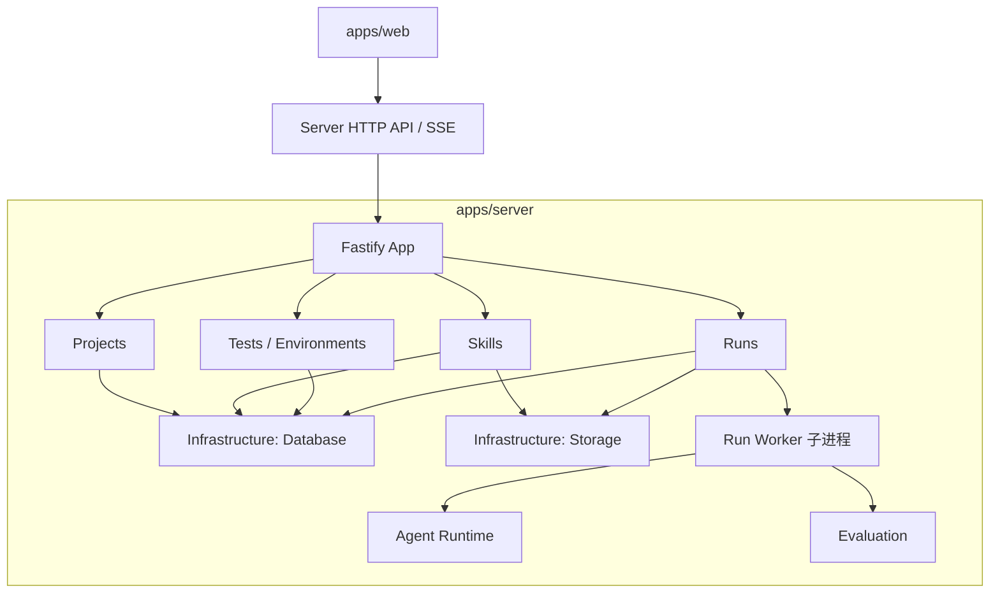

# SkillConsole 项目结构设计

> 文档状态：已确认的目录骨架
>
> 适用阶段：v0.1 开发准备
>
> 更新日期：2026-07-23

## 1. 设计目标

SkillConsole 采用 TypeScript Monorepo，只保留 Web 和 Server 两个 Workspace。全部后端能力位于 `apps/server`，Agent Run 需要隔离时由 Server 包内的 Worker 入口启动独立 Node.js 进程。

目录结构需要同时满足：

1. 前端不能直接接触数据库、文件系统、Secret 或 Claude Agent SDK；
2. HTTP API 与 Agent 执行可以分进程隔离，但不拆成不同 Workspace；
3. 产品模块可以在模块化单体中独立演进；
4. PostgreSQL、Artifact Store 和 Claude Agent SDK 可以通过明确边界替换或升级；
5. 首版不因未来可能出现的 SaaS、多 Runtime 或微服务需求而提前复杂化；
6. 只有独立运行的应用维护 Package 边界，Server 内部按产品功能组织模块。

## 2. 技术基线

| 领域 | 选择 | 说明 |
| --- | --- | --- |
| 语言 | TypeScript | Web、Server 和 Server 内 Worker 入口统一语言 |
| Node.js | `>=22.12.0` | 兼容当前本地 Node.js 22；CI 后续以 Node.js 24 LTS 为主 |
| 包管理 | npm 10+ | 使用 npm Workspaces，不在首版加入 Turborepo |
| 前端 | React 19 + Vite 8 + shadcn/ui + Tailwind CSS 4 | 独立 SPA，通过 API 和 SSE 与 Server 通信 |
| 前端数据层 | TanStack Query + TanStack Table | 管理服务端状态和数据密集型表格 |
| 后端 | Fastify 5 | 使用插件封装和按产品模块组织 Route |
| API Schema | TypeBox / JSON Schema | 用于运行时校验、类型推导和 OpenAPI |
| 数据库 | PostgreSQL | 保存结构化元数据、Run 状态、事件和断言结果 |
| 数据访问 | Drizzle ORM + `pg` | Schema 使用 TypeScript 定义，SQL Migration 纳入版本控制 |
| 实时事件 | Server-Sent Events | Server 向 Web 单向推送 Run 事件 |
| Agent Runtime | Claude Agent SDK for TypeScript | 只在 `apps/server/src/modules/runs/runtime` 内直接依赖 |
| Artifact | 本地文件系统 | PostgreSQL 只保存元数据和受控引用 |
| 日志 | Pino | Server 与 Worker 使用同一个 `runId` 关联日志 |

当前仓库已初始化前端、Fastify Server、Docker Compose 和 PostgreSQL 基础设施。后端正在按本文定义的 Server 内部模块结构完成阶段 1。

## 3. 仓库目录

```text
SkillConsole/
├── Dockerfile                    # Web + Server 生产镜像
├── compose.yaml                  # 开发与生产 Profile
├── apps/
│   ├── web/                    # React 可视化工作台和 Web Dockerfile
│   └── server/                 # 全部后端能力、Worker 入口和 Server Dockerfile
│
├── examples/
│   ├── skills/                 # 可公开的示例 Skill
│   └── test-projects/          # 示例测试项目
│
├── infra/
│   └── docker/                 # PostgreSQL 本地开发设施
│
├── docs/
│   ├── architecture/           # 聚焦的架构说明
│   ├── decisions/              # Architecture Decision Records
│   ├── project-structure.md
│   └── system-architecture-design.md
│
├── scripts/                    # 可重复的仓库级脚本
├── var/                        # 运行时数据，不纳入 Git
├── package.json
├── package-lock.json
└── tsconfig.base.json
```

`var/` 不在仓库中创建占位文件。应用首次运行时按需创建，并由 `.gitignore` 排除。

## 4. 应用目录

### 4.1 `apps/web`

React 和 Vite 构建的浏览器应用。

负责：

- 项目、Skill、测试、运行环境、Run 和结果页面；
- 表单与本地交互状态；
- 调用版本化 REST API；
- 订阅 SSE Run 事件；
- 展示 Trace、断言和 Artifact。

不负责：

- 读取本机 Skill 目录；
- 解析 Secret；
- 访问 PostgreSQL；
- 启动 Worker；
- 调用 Claude Agent SDK。

建议的内部结构：

```text
apps/web/src/
├── app/                         # Provider、Router、应用壳和全局错误边界
│   ├── layouts/
│   ├── providers/
│   └── router/
├── locales/                      # 按 Locale 和 Namespace 划分的 JSON 文案
├── routes/                      # 路由级页面
├── features/
│   ├── workbench-home/
│   ├── project-overview/
│   ├── skill-inspector/
│   ├── test-cases/
│   ├── test-case-editor/
│   ├── environment/
│   ├── run-console/
│   └── run-result/
├── shared/
│   ├── api/
│   ├── components/
│   │   ├── layout/
│   │   └── ui/
│   ├── config/
│   ├── hooks/
│   ├── i18n/                    # i18next 初始化与语言定义
│   ├── lib/
│   ├── stores/                  # Zustand 客户端偏好状态
│   └── types/
├── styles/
├── test/
└── main.tsx
```

依赖方向固定为 `app → routes → features → shared`。`features` 以产品能力划分，不使用全局 `components/` 堆放所有页面组件；跨业务复用的布局、shadcn/ui 组件、Hooks 和工具进入 `shared`。

### 4.2 `apps/server`

Fastify 模块化单体，拥有 Web API、PostgreSQL、文件存储、Skill 扫描、Run Worker、断言评测和结果读取等全部后端能力。

负责：

- Fastify 生命周期、插件和 Route；
- API 输入输出校验；
- OpenAPI；
- 产品 Use Case；
- PostgreSQL 事务；
- Run Input Snapshot；
- Worker 生命周期和 Run 调度；
- SSE 事件发布；
- 结果汇总和错误映射。

建议的内部结构：

```text
apps/server/src/
├── app/
│   ├── build-app.ts
│   └── lifecycle.ts
├── config/                       # 类型化环境配置
├── core/
│   ├── errors/                   # Server 内部错误模型
│   └── http/                     # 通用 HTTP Schema 与映射
├── infrastructure/
│   ├── database/                 # Drizzle、Schema、Repository 与事务
│   ├── storage/                  # 受控文件读写和本地存储实现
│   └── observability/            # 日志、Request ID 和运行诊断
├── modules/
│   ├── health/
│   ├── projects/
│   ├── skills/                   # 导入、扫描、校验、快照和 Skill 文件
│   ├── tests/                    # 测试用例与断言定义
│   ├── environments/             # Endpoint 与执行配置
│   └── runs/                     # 调度、Worker、Runtime、评测、产物和结果
├── app.ts
└── main.ts
```

每个产品模块作为 Fastify Plugin 注册，模块内部可以包含：

```text
<module>/
├── <module>.plugin.ts
├── <module>.routes.ts
├── <module>.schemas.ts
├── <module>.service.ts
└── <module>.mapper.ts
```

Route Handler 只处理 HTTP 边界，不直接写 SQL，也不直接调用 Claude Agent SDK。

### 4.3 Server 内 Worker 进程

每次 Agent Run 仍可使用独立 Node.js 进程，但 Worker 是 `apps/server` 的内部运行入口，不是独立 Workspace，也不维护第二套依赖。

负责：

- 接收版本化 Run 命令；
- 创建临时 Workspace；
- 写入 Skill Snapshot 和 Fixture；
- 解析本次 Run 所需 Secret；
- 调用 Agent Runtime；
- 标准化 SDK Event；
- 收集 Artifact 和 Workspace Diff；
- 执行取消、超时、预算和大小限制；
- 在终态后退出。

Worker 位于 Run 模块内部：

```text
apps/server/src/modules/runs/
├── orchestration/       # 调度、进程注册和取消
├── worker/              # Worker 入口、IPC 和生命周期
├── runtime/             # Claude Agent SDK Adapter
├── evaluation/          # 确定性断言
├── artifacts/           # Run Artifact 与 Workspace Diff 规则
└── events/              # 标准化事件与 SSE 投影
```

Worker 不提供 HTTP API，也不直接修改产品表。它只通过版本化 IPC 向 Server 主进程发送事件，所有持久化仍由 Server 主进程完成。

## 5. Server 内部模块

### 5.1 `modules/projects`

负责工作台项目的生命周期、项目级聚合读取以及删除前的关联资源检查。

### 5.2 `modules/skills`

负责：

- 导入文件夹或 ZIP；
- 发现和解析 `SKILL.md`；
- 校验元数据、引用、符号链接和路径边界；
- 计算内容 Hash；
- 创建不可变 Skill Snapshot；
- 管理 Skill 文件与快照的业务元数据。

扫描阶段不得执行 Skill 中的脚本。实际文件读写通过 `infrastructure/storage` 完成，Skill 模块拥有扫描与快照规则。

### 5.3 `modules/tests` 与 `modules/environments`

`tests` 保存测试输入、Fixture、预期行为和断言定义；`environments` 保存 Endpoint 的非敏感配置、模型和执行策略。两者都不启动 Agent。

### 5.4 `modules/runs`

Run 模块是执行闭环，负责：

- 创建不可变 Run Input Snapshot；
- 启动和取消包内 Worker 子进程；
- 适配 Claude Agent SDK；
- 标准化并持久化 Run Event；
- 执行确定性断言；
- 收集 Artifact 和 Workspace Diff；
- 汇总最终状态并通过 SSE 投影事件。

Runtime、Evaluation 和 Run Artifact 彼此围绕同一份 Run Evidence 协作，因此保留在一个 Run 模块中，不拆成独立 Package。

### 5.5 `infrastructure`

基础设施只提供 Server 内部实现：

- `database`：连接池、Drizzle Schema、Migration、Repository 和事务；
- `storage`：安全相对路径、原子写入、容量限制和本地文件系统实现；
- `observability`：结构化日志、Request ID、Run ID 和诊断信息。

基础设施不包含产品流程。未来更换 PostgreSQL、S3 或其他实现时，通过 Server 内部接口替换，不需要新增 Workspace。

### 5.6 `core`

`core` 只保存跨模块使用且不属于某个产品功能的 Server 内部基础类型，例如错误模型、HTTP 错误响应和标识符。不得把具体业务逻辑堆入 `core`。

## 6. 支撑目录

### 6.1 `examples`

保存可公开、无 Secret、可审查的示例 Skill 和测试项目，用于：

- 新用户首次运行；
- 手动验证；
- 集成测试；
- 文档示例。

### 6.2 `infra/docker`

根目录 `compose.yaml` 是开发和生产启动的唯一 Compose 入口。`infra/docker` 只在后续确实需要时保存 Compose 引用的辅助配置，例如：

- 初始化脚本；
- 数据库维护脚本；
- 镜像构建辅助文件。

不要在该目录再维护第二份 Compose 入口或重复启动说明。

### 6.3 `docs/architecture`

保存围绕单个主题的架构说明。产品与系统总览继续保留在 `docs/system-architecture-design.md`，避免无必要移动已经存在的文档。

### 6.4 `docs/decisions`

保存对实现形成长期约束的 ADR，例如：

- 选择 PostgreSQL；
- Run Event 使用 SSE；
- Worker 使用独立进程；
- Artifact 不进入数据库。

普通模块内部实现不需要 ADR。

### 6.5 `scripts`

保存可重复、可审查的仓库级脚本：

- 数据库 Migration；
- 示例数据；
- 打包和发布。

脚本应显式接收路径、失败时返回非零状态，并避免嵌入 Secret。

开发和部署入口统一使用根目录 `compose.yaml`，不再使用宿主机 Node.js 启动脚本。

### 6.6 README 放置规则

说明文件只保留在能够独立运行或需要独立维护契约的边界：

- 仓库根目录：产品、开发与部署总入口；
- `apps/web/README.md`：前端技术边界；
- `apps/server/README.md`：后端技术边界；
- Docs、Example 等需要独立维护说明的一级目录。

不在 `src` 的每个 Feature、Component、Hook 或 Type 目录重复创建 README。代码结构约束集中写入 `docs/architecture`。

### 6.7 `var`

运行时按需创建：

```text
var/
├── artifacts/
├── snapshots/
├── workspaces/
└── diagnostics/
```

该目录不纳入 Git。临时 Workspace、Artifact 和诊断信息需要分别应用容量与保留策略。

## 7. 依赖方向



禁止出现：

- Web 直接访问数据库、文件系统、Secret 或 Agent Runtime；
- Route Handler 直接写 SQL、操作文件或调用 Claude Agent SDK；
- Worker 子进程直接修改产品表；
- `infrastructure` 反向调用具体产品流程；
- 模块绕过公开 Service 直接修改其他模块内部状态。

## 8. PostgreSQL 使用边界

PostgreSQL 保存：

- Project、SkillSource 和 SkillSnapshot Metadata；
- TestSuite、TestCase 和 Assertion；
- EndpointProfile 的非敏感字段；
- ExecutionProfile；
- Run、RunInputSnapshot；
- RunEvent；
- AssertionResult；
- Artifact Metadata 和受控引用。

PostgreSQL 不保存：

- 明文 API Key；
- 大体积 Artifact；
- 临时 Run Workspace；
- 用户本地 Skill 源目录的可变副本；
- 未脱敏的完整调试日志。

首版不增加 Redis。单 Server 使用进程内调度管理 Worker，PostgreSQL 保存 Run 状态。只有出现多 Server 实例、分布式 Worker 或可靠延迟任务需求后，才决定使用 PostgreSQL Queue 或 Redis。

## 9. 当前骨架与后续步骤

当前阶段已创建：

- Web 与 Server 两个 npm Workspace；
- 定义 npm Workspaces 的根 `package.json`；
- `tsconfig.base.json`；
- `.editorconfig` 和 `.gitignore`；
- 应用级 `package.json`；根 `package-lock.json` 由首次 npm 安装生成并纳入版本控制；
- React、Vite、TypeScript、Tailwind CSS、ESLint 和 Vitest 配置；
- shadcn/ui 的 `components.json`；
- 首页应用壳、Headless Controller 和受控 Feature 组件；
- Button、Dialog、Input、Label、Toggle Group 和 Sonner 等 shadcn/ui 源码组件；
- Ink Signal 首页主题 Token 与全局样式；
- 前端组件架构文档；
- Fastify 插件化启动、存活/就绪探针、统一错误、开发环境 OpenAPI 和生产静态托管基础；
- PostgreSQL Docker Compose 基础设施；
- Server 内类型化配置、Drizzle 数据库客户端、初始 Project Schema 与 SQL Migration；
- Compose 一次性数据库迁移服务和 Server 启动门禁；
- 本文档。

当前阶段不创建：

- 项目详情及后续产品页面；
- 完整 React Router 路由表；
- Run Worker 子进程入口；
- Project 之外的业务表和业务 Migration；
- 前后端 API 集成；
- 产品级自动化测试和 CI。

下一阶段建议在当前组件分层基础上实现 Project Overview 页面，并将首页的内存状态替换为 Fastify API。后端首个纵向切片仍建议是：

```text
创建 Project
  → 导入本地 Skill
  → 保存 PostgreSQL Metadata
  → Web 展示扫描结果
```

该切片可以先验证 React、Fastify、PostgreSQL、Schema Contract 和本地文件系统边界，不需要立即接入 Claude Agent SDK。
