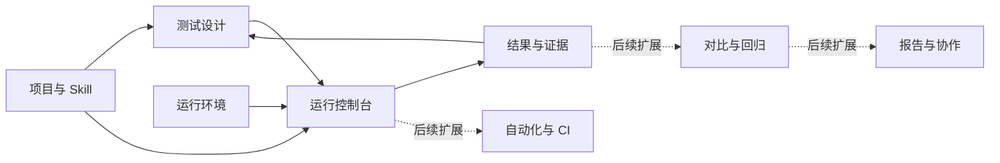
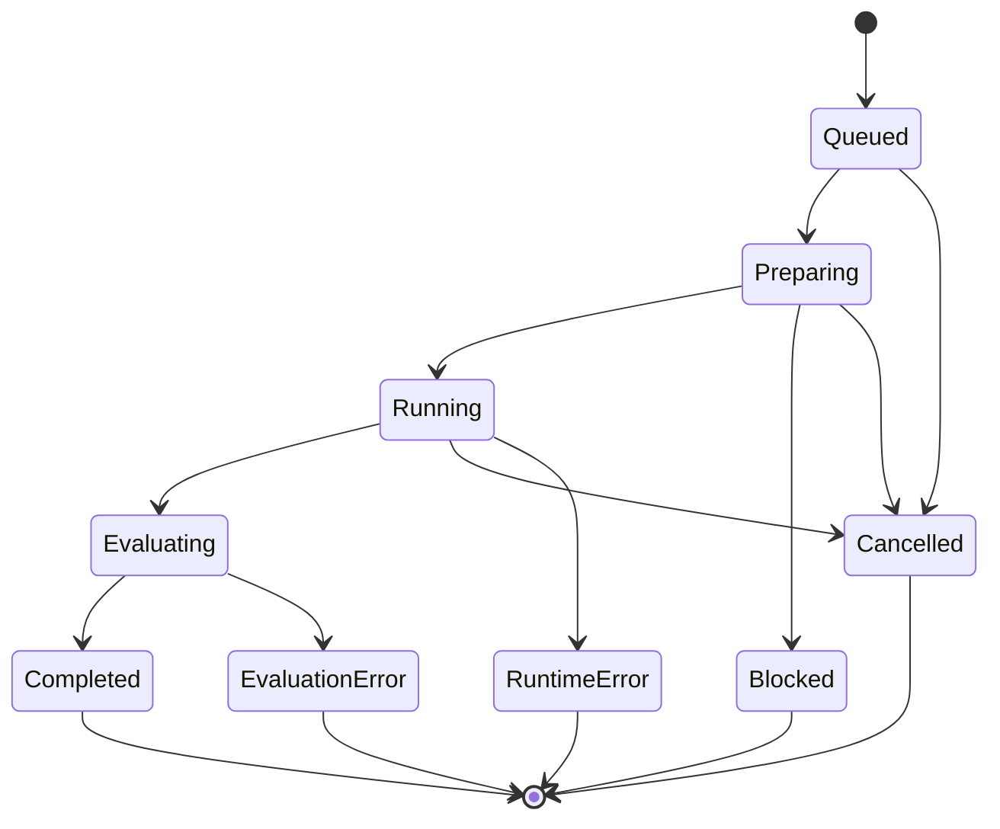
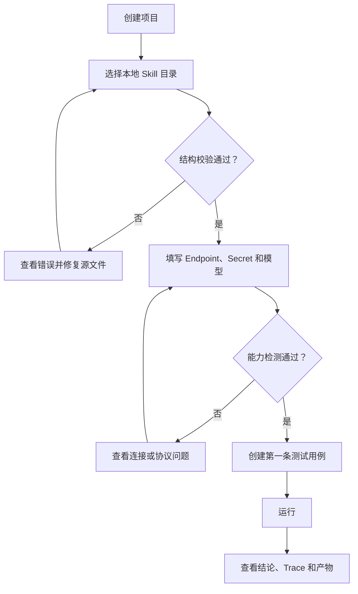
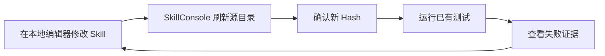
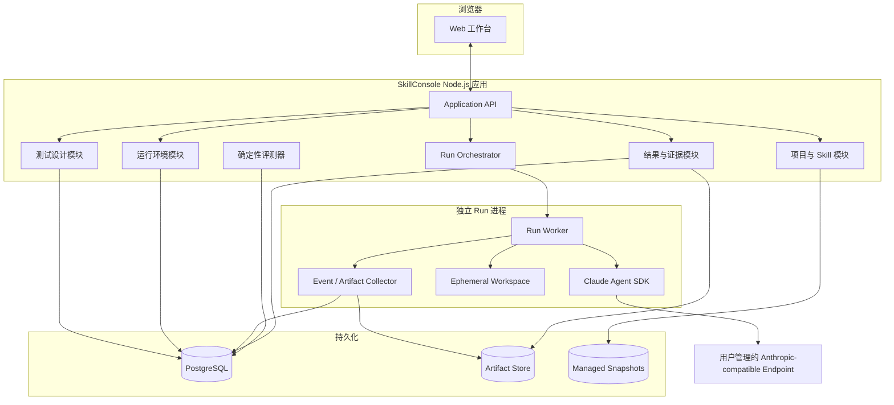
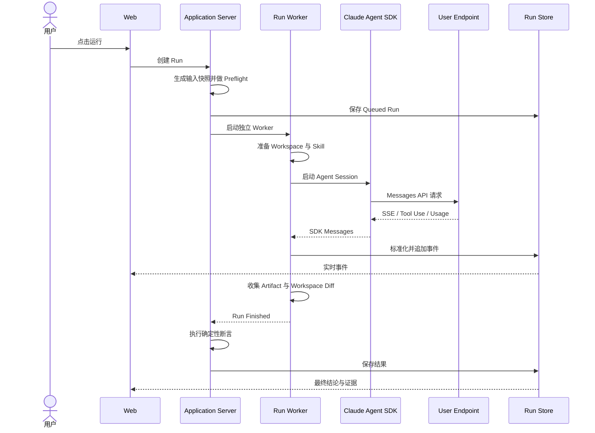
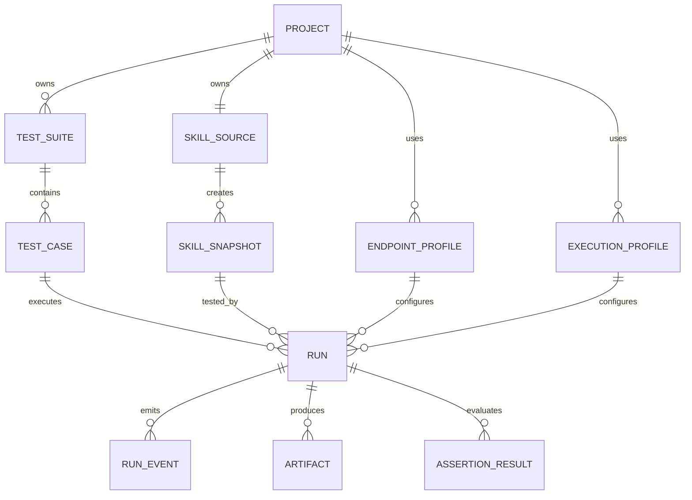

# SkillConsole 产品与系统架构设计

> 文档状态：产品与架构初稿
>
> 目标版本：v0.1 本地单用户测试工作台
>
> 技术前提：React、Vite、Fastify、PostgreSQL、Claude Agent SDK for TypeScript
>
> 更新日期：2026-07-23

## 1. 文档定位

本文从产品目标出发，先定义 SkillConsole 应解决的核心问题、主要产品模块和模块内功能，再将这些产品模块映射为系统架构。

仓库中的 README 用于描述长期愿景、可能能力和项目边界，不等同于首版功能清单。本文对 README 中的功能进行重新取舍，首版只围绕一条最重要的用户闭环设计：

```text
导入 Skill
  → 创建测试
  → 配置运行环境
  → 执行 Agent
  → 查看结果与证据
  → 修改 Skill 后再次测试
```

首版产品不追求成为 Skill 市场、完整 IDE、通用 Agent 平台或企业测试管理系统。

## 2. 产品方向选择

### 2.1 三种可选建设路线

| 路线 | 首要目标 | 优点 | 主要风险 | 结论 |
| --- | --- | --- | --- | --- |
| A. 测试闭环优先 | 尽快完成一次可信的 Skill 测试 | 最早验证核心价值，边界清楚，适合开源项目起步 | 资产管理和报告能力较弱 | **推荐** |
| B. Skill 管理优先 | 先建立完整的 Skill 仓库和版本体系 | 资产组织完善，适合大量 Skill | 容易先做成管理后台，却不能证明 Skill 是否有效 | 暂不采用 |
| C. 评测平台优先 | 先建设批量评测、对比和报告 | 结果表达完整，适合团队和 CI | 依赖稳定 Runtime 和证据模型，首版复杂度过高 | 后续演进 |

本文采用路线 A。所有首版功能都必须服务于“能运行、能观察、能判断、能复现”这四个结果。

### 2.2 产品边界

| 范围 | v0.1 首版 | 后续版本 | 当前不做 |
| --- | --- | --- | --- |
| 主要用户 | 本地开发和测试 Skill 的个人开发者 | 测试工程师、领域审核人、团队负责人 | 公共 Skill 消费者市场 |
| Skill 来源 | 本地目录导入、手动刷新 | Git 仓库、Commit、分支和标签 | 在线 Skill 商店 |
| Skill 编辑 | 查看内容和目录，不内置完整编辑器 | 轻量编辑或与本地 IDE 联动 | 替代专业 IDE |
| 测试执行 | 单条用例、测试集顺序执行 | 并发、定时、CI 触发 | 通用工作流编排平台 |
| 评测方式 | 确定性断言、人工查看证据 | 模型评分、版本回归、稳定性评测 | 只依赖不可解释的总分 |
| 结果能力 | Run 详情、Trace、产物和断言结果 | 对比、报告、人工审核 | 企业级 BI |
| 部署方式 | 本地单用户 | 局域网团队版、容器化 Worker | 首版 SaaS |

## 3. 产品定义

### 3.1 核心问题

Skill 作者需要回答的不是“文件是否存在”，而是以下问题：

1. Skill 的结构是否能够被 Claude Agent SDK 正确发现？
2. 面对应该触发的请求时，Skill 是否实际参与了 Agent 执行？
3. 面对无关请求时，Skill 是否错误触发？
4. Agent 是否按预期调用工具、读取资源和生成产物？
5. 失败来自 Skill、测试用例、运行配置，还是 Endpoint？
6. 修改 Skill 后，能否用相同输入再次运行并比较结果？

SkillConsole 的核心价值是把这些问题变成可操作、可观察和可复现的测试流程。

### 3.2 主要用户

首版只为一个主要角色优化：

**Skill 作者 / Agent 开发者**

- 已经拥有一个本地 Skill 目录；
- 能够自行提供 Endpoint URL、API Key 或 Secret 引用、模型标识；
- 希望用可视化方式设计输入、执行测试、查看 Trace 和产物；
- 仍然使用自己的编辑器修改 Skill；
- 需要快速判断一次修改是否有效。

测试工程师、领域审核人员和团队管理员属于后续角色。首版不因这些角色提前引入权限、审批、分派和组织结构。

### 3.3 核心产品结果

一次有效的测试必须同时产生四类结果：

| 结果 | 用户需要看到什么 |
| --- | --- |
| 可运行 | Runtime 是否成功启动，Endpoint 是否满足协议，Agent 是否正常结束 |
| 可观察 | 消息、Skill 调用、工具调用、错误、耗时和产物 |
| 可判断 | 测试是通过、失败、阻塞、系统错误还是被取消，以及判断依据 |
| 可复现 | 本次使用的 Skill、测试输入、模型、配置和应用版本快照 |

### 3.4 产品成功指标

首版不以注册量或 Skill 数量作为主要指标，优先验证以下产品指标：

- 首次用户在完成 Endpoint 配置后，10 分钟内完成第一条测试；
- 每次 Run 都能查看输入快照、事件时间线和最终状态；
- Runtime 错误与测试失败能够被明确区分；
- 使用同一输入快照可以再次执行；
- 用户不打开原始日志文件，也能定位大多数失败发生在哪个阶段。

## 4. 主要模块设计

### 4.1 模块总览



首版由五个核心模块组成：

1. 项目与 Skill；
2. 测试设计；
3. 运行环境；
4. 运行控制台；
5. 结果与证据。

对比回归、报告协作、团队管理和 CI 自动化是扩展模块，不进入最小可用闭环。

### 4.2 模块职责边界

| 模块 | 核心职责 | 明确不负责 | 主要输出 |
| --- | --- | --- | --- |
| 项目与 Skill | 引入、检查、展示并快照 Skill | 完整代码编辑、远程市场 | Skill Snapshot |
| 测试设计 | 定义输入、Fixture、期望和断言 | 执行 Agent、解释 Runtime 错误 | Test Case Snapshot |
| 运行环境 | 配置 Endpoint、模型、Secret 和执行策略 | 识别或预设模型厂商 | Environment Snapshot |
| 运行控制台 | 组装输入、启动 Worker、展示进度和控制生命周期 | 保存长期分析结论 | Run 与 Event Stream |
| 结果与证据 | 汇总状态、Trace、断言和产物 | 自动替用户决定根因 | Run Result |

## 5. 模块功能设计

功能优先级定义：

- **P0**：缺失后无法形成首版测试闭环；
- **P1**：明显提升测试效率，但不阻塞首版；
- **Later**：依赖首版数据和用户反馈后再决定。

### 5.1 项目与 Skill

#### 5.1.1 模块目标

让用户知道“当前测试的是哪一个 Skill、内容是什么、结构是否有效”，并保证每次 Run 使用不可变快照，而不是运行过程中变化的源目录。

#### 5.1.2 P0 功能

| 功能 | 说明 | 关键产品规则 |
| --- | --- | --- |
| 创建项目 | 为一个待测试的 Skill 建立独立工作区 | 一个项目首版只绑定一个主 Skill |
| 导入本地目录 | 选择包含 `SKILL.md` 的目录 | 不自动执行目录内脚本 |
| 结构校验 | 检查 `SKILL.md`、目录边界和引用文件 | 错误与警告分开展示 |
| 内容浏览 | 展示 `SKILL.md` 和 Supporting Files 树 | 首版只读，不做完整编辑器 |
| 刷新源目录 | 重新扫描用户修改后的 Skill | 展示内容 Hash 是否变化 |
| 创建运行快照 | 将本次使用的 Skill 复制到 Run Workspace | Run 开始后不可修改 |
| 风险提示 | 标记脚本、可执行文件、越界引用等风险 | 提示不等于安全隔离保证 |

#### 5.1.3 P1 与后续功能

- 从 Git URL、分支、Tag 或 Commit 导入；
- 展示两个 Skill Snapshot 的文件差异；
- 维护版本名称、标签和发布备注；
- 与 VS Code 或本地文件管理器联动；
- 在浏览器内提供小范围文本编辑。

#### 5.1.4 关键界面

**Skill 概览**

- 当前源目录；
- 最近扫描时间；
- 当前内容 Hash；
- 文件数量和总大小；
- 错误、警告和风险摘要；
- “刷新并重新扫描”主操作。

**Skill 文件**

- 左侧文件树；
- 右侧只读内容预览；
- `SKILL.md` 默认打开；
- 二进制文件只显示元数据，不直接执行或解析。

#### 5.1.5 验收条件

- 用户可以导入一个有效 Skill 并看到完整文件树；
- 缺少 `SKILL.md` 时不能进入可运行状态；
- 修改源文件后，页面能够提示 Hash 已变化；
- 已启动 Run 的 Skill Snapshot 不受后续源目录修改影响。

### 5.2 测试设计

#### 5.2.1 模块目标

让用户用产品化方式表达“给 Agent 什么输入、希望发生什么、如何判断”，避免每次只在聊天框中临时输入 Prompt。

#### 5.2.2 测试用例结构

每条测试用例由五部分组成：

```text
基本信息
├── 名称
├── 测试目的
└── 测试类型

输入
├── 用户 Prompt
├── System Prompt 补充
└── Fixture 文件

预期行为
├── 是否应该触发 Skill
├── 允许或禁止的工具
└── 预期产物

断言
├── 文本断言
├── 结构化数据断言
├── 文件断言
└── 工具行为断言

运行覆盖
└── 可选的 Environment / Execution Profile
```

#### 5.2.3 P0 测试类型

| 类型 | 要回答的问题 | P0 判断方式 |
| --- | --- | --- |
| 静态测试 | Skill 结构和元数据是否有效 | Parser 规则 |
| 正向触发测试 | 相关请求是否使用了 Skill | 可观察的 Skill 调用事件 |
| 负向触发测试 | 无关请求是否没有使用 Skill | 未出现 Skill 调用事件 |
| 能力测试 | 是否完成任务并生成预期结果 | 文本、JSON、文件和退出状态断言 |
| 安全行为测试 | 是否调用了禁止工具或访问越界路径 | Tool Event 与权限拒绝事件 |

若 SDK 或 Endpoint 没有提供足够的可观察事件，产品必须将对应断言标记为“无法判断”，不能根据最终文本猜测 Skill 已触发。

#### 5.2.4 P0 功能

| 功能 | 说明 |
| --- | --- |
| 新建测试集 | 按场景组织测试用例 |
| 新建和复制用例 | 复用相近输入和期望 |
| Prompt 编辑 | 编辑用户输入和必要的上下文 |
| Fixture 管理 | 上传或选择本次测试需要的文件 |
| 测试类型选择 | 决定页面重点展示的期望和断言 |
| 确定性断言 | 支持文本、正则、JSON、文件和工具事件 |
| 用例启停 | 暂时排除未完成或不适用用例 |
| 保存草稿 | 未满足运行条件时也允许保存 |
| 立即运行 | 从用例页直接启动一次 Run |

#### 5.2.5 建议的确定性断言

首版只实现少量、可解释的断言：

- 最终文本包含 / 不包含；
- 最终文本匹配正则表达式；
- 最终输出可解析为 JSON；
- JSON 字段存在或等于指定值；
- 指定文件存在 / 不存在；
- 文件内容包含指定文本；
- 指定工具被调用 / 未被调用；
- Skill 被调用 / 未被调用；
- Run 在超时和预算内结束。

模型评分、复杂 Rubric 和多轮人工审核放到后续版本。

#### 5.2.6 产品交互原则

- 测试类型只改变默认字段和推荐断言，不隐藏底层证据；
- 每个断言必须说明读取了哪一份证据；
- 无法执行的断言显示 `Blocked`，不能计为 `Failed`；
- Fixture 在保存时做大小、路径和类型检查；
- 测试用例保存后，Run 仍然使用启动时生成的 Test Case Snapshot。

### 5.3 运行环境

#### 5.3.1 模块目标

让用户自行配置一个可被 Claude Agent SDK 使用的推理 Endpoint，同时把连接信息和 Agent 执行策略分开，避免把模型厂商、连接协议和权限策略混为一体。

SkillConsole 不提供按厂商划分的 Provider 预设。

#### 5.3.2 配置分层

**Endpoint Profile**

- Endpoint URL；
- API Key、会话 Secret 或环境变量引用；
- 模型标识；
- 自定义 Headers；
- 协议能力检测结果。

**Execution Profile**

- System Prompt 模式；
- 可用工具；
- 权限模式；
- 最大轮数；
- 超时时间；
- 预算上限；
- 工作区写入策略；
- Agent 工具网络策略。

这种拆分允许用户在同一个 Endpoint 下测试不同执行策略，也允许在不改变测试用例的情况下替换 Endpoint。

#### 5.3.3 Endpoint 协议要求

SkillConsole 使用 Node.js 版本的 Claude Agent SDK，即：

```text
@anthropic-ai/claude-agent-sdk
```

用户配置的 Endpoint 必须实现 Claude Agent SDK 所需的 Anthropic Messages API 行为，主要包括：

- `POST /v1/messages`；
- SSE 流式响应；
- `tool_use` 与 `tool_result` 内容块；
- 停止原因字段；
- Usage Metadata；
- SDK 执行 Agent Loop 所需的其他兼容行为。

只有 OpenAI 风格的 `/v1/chat/completions` 接口不能直接视为可用。用户可以使用企业网关、New API、LiteLLM、Claude Code Router 或自建转换服务，但协议转换正确性、模型能力、费用和数据处理由用户或网关方负责。

#### 5.3.4 P0 功能

| 功能 | 说明 | 产品反馈 |
| --- | --- | --- |
| 新建 Endpoint Profile | 填写 URL、Secret 和模型 | 不出现厂商选择器 |
| Secret 输入 | 支持会话内输入和环境变量引用 | 永不回显完整值 |
| Headers 配置 | 支持必要的企业网关 Headers | 对敏感值做遮罩 |
| 连接检测 | 检查 URL、认证和基础响应 | 区分网络、认证和协议错误 |
| 能力检测 | 检查 Streaming、Tool Use 和 Usage | 明确提示可能产生模型调用费用 |
| Execution Profile | 配置工具、权限、轮数、超时和预算 | 提供安全默认值 |
| 设为项目默认 | 减少每次运行的重复选择 | Run 时仍可覆盖 |

#### 5.3.5 Secret 策略

首版推荐支持两种方式：

1. **环境变量引用**：保存变量名，不保存 Secret；
2. **会话内 Secret**：只保存在服务进程内存中，重启后重新输入。

首版不在 PostgreSQL、浏览器 Local Storage、运行事件、导出文件或 Skill Snapshot 中保存明文 Secret。系统密钥环或加密 Secret Store 可以在后续版本加入。

#### 5.3.6 状态设计

Endpoint Profile 使用以下状态：

| 状态 | 含义 |
| --- | --- |
| Draft | 配置尚未检测 |
| Verified | 最近一次能力检测通过 |
| Partial | 可以请求，但缺少测试需要的部分能力 |
| Failed | 连接、认证或协议检测失败 |
| Stale | URL、模型或 Headers 变更后尚未重新检测 |

### 5.4 运行控制台

#### 5.4.1 模块目标

将 Skill Snapshot、Test Case Snapshot 和 Environment Snapshot 组装成一次可控制、可观察的 Agent Run。

#### 5.4.2 P0 功能

| 功能 | 说明 |
| --- | --- |
| 运行前检查 | 检查 Skill、测试、Endpoint、Secret 和权限配置 |
| 单条运行 | 从测试用例启动一次运行 |
| 测试集运行 | 顺序执行测试集中的启用用例 |
| 实时状态 | 展示排队、准备、执行、评分和结束阶段 |
| 流式输出 | 展示 Agent 文本和关键事件 |
| 取消运行 | 请求 Worker 停止并保存已有证据 |
| 失败重试 | 使用相同输入快照重新执行 |
| 运行备注 | 用户为一次 Run 添加简短说明 |

首版测试集采用顺序执行，避免过早引入并发、限流和共享资源竞争。

#### 5.4.3 Run 状态机



`Completed` 只表示运行和评测流程完整结束，最终测试结论仍然可以是 `Passed` 或 `Failed`。

#### 5.4.4 结果分类

| 分类 | 含义 | 示例 |
| --- | --- | --- |
| Passed | 所有必须断言通过 | 产物存在且内容符合预期 |
| Failed | Agent 正常运行，但行为不符合期望 | Skill 未触发或文件缺失 |
| Blocked | 前置条件不足，无法得出测试结论 | Endpoint 不支持 Tool Use |
| Runtime Error | Agent 或 Worker 执行异常 | SDK 进程退出、超时 |
| Evaluation Error | 评测器自身异常 | 正则无效、JSON Schema 错误 |
| Cancelled | 用户主动取消 | 运行中点击停止 |

产品不能把 `Runtime Error` 统计为 Skill 测试失败，否则会污染后续回归结果。

#### 5.4.5 运行前确认信息

启动按钮附近应明确显示：

- Skill 名称和内容 Hash；
- 测试用例或测试集；
- Endpoint Profile 和模型标识；
- Execution Profile；
- 预计会开放的工具和目录；
- 可能产生模型费用；
- Secret 是否已经可用。

### 5.5 结果与证据

#### 5.5.1 模块目标

让用户先看到结论，再沿着证据定位原因。页面不能只展示一段最终回复，也不能要求用户阅读未经整理的原始 JSONL 日志。

#### 5.5.2 结果页信息层级

```text
第一层：结论
├── Passed / Failed / Blocked / Error
├── 失败原因摘要
└── 耗时、轮数和 Usage

第二层：断言
├── 每条断言状态
├── 实际值与期望值
└── 证据链接

第三层：执行过程
├── 消息
├── Skill 调用
├── 工具调用与结果
├── 权限拒绝
└── 错误

第四层：产物与复现
├── 生成文件
├── 工作区变更
├── 输入快照
└── 使用相同快照重跑
```

#### 5.5.3 P0 功能

| 功能 | 说明 |
| --- | --- |
| 结果摘要 | 结论、主要失败项、耗时、轮数和 Usage |
| 断言列表 | 展示实际值、期望值和证据来源 |
| Trace 时间线 | 按时间展示标准化事件 |
| 工具详情 | 展示工具名、脱敏输入、结果、耗时和状态 |
| Skill 激活证据 | 展示可观察到的 Skill 调用事件 |
| 产物浏览 | 查看文件列表、大小、类型和文本预览 |
| 工作区差异 | 展示运行前后新增、修改和删除的文件 |
| 错误分类 | 区分配置、协议、权限、SDK、Agent 和评测错误 |
| 输入快照 | 查看本次 Skill、测试和环境摘要 |
| 相同快照重跑 | 新建 Run，不覆盖历史记录 |

#### 5.5.4 诊断辅助原则

- 先展示可验证事实，再给出可能原因；
- 自动诊断必须标注为建议，不能替代原始证据；
- Tool 输入和输出在进入事件存储前完成敏感字段脱敏；
- 超长事件和文件采用摘要加按需加载；
- 二进制产物首版只提供下载和元数据，不承诺在线预览；
- 历史 Run 不允许被新运行覆盖或原地修改。

## 6. 核心用户流程

### 6.1 第一次使用



第一次使用的产品重点是减少配置歧义。Endpoint 能力检测必须在正式运行前给出清晰反馈。

### 6.2 日常迭代



首版不要求用户在 SkillConsole 内编辑 Skill。测试平台与代码编辑器各自承担擅长的任务，可以明显降低首版复杂度。

### 6.3 从失败回到测试设计

结果页需要提供以下回路：

- 返回测试用例修改输入或断言；
- 使用相同输入重跑；
- 刷新 Skill 后重跑；
- 更换 Execution Profile 后重跑；
- 后续版本中，将两次 Run 加入对比。

## 7. 信息架构

### 7.1 首版导航

```text
项目
├── 概览
├── Skill
├── 测试
├── Runs
└── 环境

全局
└── 设置
```

首版导航中不出现空的“报告”“团队”“市场”和“CI”入口。功能可用后再加入，避免用占位页面放大未完成感。

### 7.2 关键页面

| 页面 | 用户问题 | 主操作 |
| --- | --- | --- |
| 项目概览 | 我现在测试的是什么，最近结果如何？ | 继续最近测试 |
| Skill | 当前内容是否有效，是否已经变化？ | 刷新并扫描 |
| 测试列表 | 有哪些测试，哪些启用？ | 新建测试 |
| 测试编辑 | 输入和期望是什么？ | 保存并运行 |
| Run 控制台 | 现在运行到哪里？ | 取消运行 |
| Run 结果 | 为什么通过或失败？ | 查看证据 / 重跑 |
| 环境 | Endpoint 和执行策略是否可用？ | 检测能力 |

## 8. 系统架构

### 8.1 架构选择

首版采用“模块化单体服务 + 每次 Run 独立 Worker 进程”。

| 方案 | 开发成本 | 运行隔离 | 取消与回收 | 后续扩展 | 结论 |
| --- | --- | --- | --- | --- | --- |
| Web、API、SDK 全在同一进程 | 低 | 差 | 容易影响整个服务 | 差 | 不采用 |
| 模块化单体 + 独立 Worker 进程 | 中 | 中 | 可单独终止 | 可迁移到容器 | **首版采用** |
| API + Queue + 一次性容器 | 高 | 强 | 完整 | 适合托管和多租户 | 后续采用 |
| 完整微服务 | 很高 | 取决于实现 | 复杂 | 理论上高 | 首版不采用 |

独立进程能隔离崩溃、释放资源并实现取消，但不能被视为执行不可信代码的完整安全边界。首版应明确只运行用户主动导入并信任的本地 Skill。

### 8.2 总体架构



### 8.3 产品模块到技术模块的映射

| 产品模块 | 服务端模块 | Worker 能力 | 存储 |
| --- | --- | --- | --- |
| 项目与 Skill | ProjectService、SkillScanner、SnapshotService | 准备 `.claude/skills` | Project、SkillSource、SkillSnapshot |
| 测试设计 | TestSuiteService、TestCaseService | 注入 Prompt 和 Fixture | TestSuite、TestCase、Fixture |
| 运行环境 | EndpointProfileService、ExecutionProfileService、SecretResolver | 注入 SDK Options 和 Secret | Profile 元数据，不保存明文 Secret |
| 运行控制台 | RunOrchestrator、RunQueue | Run Lifecycle、SDK Adapter | Run、RunInputSnapshot、RunEvent |
| 结果与证据 | ResultService、ArtifactService、Grader | 事件与文件收集 | AssertionResult、Artifact、WorkspaceDiff |

### 8.4 进程职责

**Web 应用**

- 展示和编辑产品数据；
- 订阅 Run 实时事件；
- 不直接持有 Endpoint Secret；
- 不直接访问 Run Workspace。

**Application Server**

- 校验用户输入；
- 保存项目、测试和配置元数据；
- 创建不可变 Run Input Snapshot；
- 管理 Worker 生命周期；
- 将事件推送给 Web；
- 运行确定性评测和结果汇总。

**Run Worker**

- 创建独立临时工作目录；
- 写入 Skill Snapshot 和 Fixture；
- 设置明确的 Claude 配置目录和环境变量；
- 通过 Claude Agent SDK 启动 Agent Session；
- 标准化 SDK 消息、工具调用、错误和 Usage；
- 收集工作区变更与产物；
- 响应取消、超时和预算终止；
- 结束后销毁临时工作区或按调试策略保留。

## 9. Runtime 设计

### 9.1 Run 输入快照

Run 创建时生成不可变的 `RunInputSnapshot`：

```text
RunInputSnapshot
├── appVersion
├── sdkVersion
├── skillSnapshotId
├── skillContentHash
├── testCaseSnapshot
├── fixtureManifest
├── endpointProfileSnapshot
├── executionProfileSnapshot
├── graderSnapshot
└── createdAt
```

Endpoint Profile Snapshot 只保存非敏感配置和 Secret 引用，不保存解析后的 Secret。

### 9.2 Run Workspace

```text
<run-workspace>/
├── CLAUDE.md
├── .claude/
│   ├── settings.json
│   └── skills/
│       └── <skill-name>/
│           ├── SKILL.md
│           └── ...
├── fixtures/
├── output/
└── .skillconsole/
    └── run-manifest.json
```

Agent SDK 的 Skill 发现应显式使用本次 Run 的项目配置来源，不能无意继承宿主机的用户级 Claude 配置。每次运行使用独立的 Claude 配置目录，并关闭不受 Run Snapshot 控制的持久化记忆能力。

### 9.3 Run 时序



### 9.4 标准化事件协议

Web、Server、Worker 和未来容器 Worker 之间不直接依赖 SDK 原始对象，使用版本化的内部事件协议：

```text
RunQueued
RunPreparing
RunStarted
AssistantMessage
UserMessage
SkillInvoked
ToolStarted
ToolCompleted
ToolDenied
ArtifactCreated
WorkspaceChanged
UsageUpdated
RuntimeWarning
RuntimeError
RunCancelled
RunCompleted
```

每个事件至少包含：

- `schemaVersion`；
- `runId`；
- `sequence`；
- `occurredAt`；
- `type`；
- `source`；
- `payload`；
- `redaction` 信息。

事件必须追加写入，不能为了更新 UI 而覆盖历史事件。SDK 原始消息可以作为受控调试数据保留，但 UI 和评测器只依赖标准化事件。

### 9.5 Worker 通信

首版可以使用 Node IPC 或 JSON Lines 管道。通信协议需要支持：

- Server 向 Worker 发送开始和取消命令；
- Worker 按顺序发送事件；
- 心跳和失联检测；
- 最大消息大小限制；
- Worker 非正常退出后的最后状态回收；
- 协议版本检查。

该协议是未来将本地进程替换为容器 Worker 的边界。

## 10. 数据设计

### 10.1 核心实体



### 10.2 实体职责

| 实体 | 说明 |
| --- | --- |
| Project | 首版工作区边界 |
| SkillSource | 用户选择的本地源目录及扫描状态 |
| SkillSnapshot | 某一时刻的不可变 Skill 内容 |
| TestSuite | 测试用例分组 |
| TestCase | 可编辑的当前测试定义 |
| EndpointProfile | 非厂商化的连接配置 |
| ExecutionProfile | Agent 工具、权限和资源限制 |
| Run | 一次执行的生命周期与最终状态 |
| RunInputSnapshot | Run 使用的全部非敏感输入快照 |
| RunEvent | 追加写入的标准化事件 |
| Artifact | 运行生成或收集的文件 |
| AssertionResult | 断言实际值、期望值、状态和证据引用 |

### 10.3 存储选择

首版采用：

- PostgreSQL：项目、测试、Profile 元数据、Run、Event 和断言结果；
- PostgreSQL `jsonb`：版本化的 Event Payload 和少量需要保留结构的快照字段；
- 本地文件系统：Skill Snapshot、Fixture、Artifact 和大体积调试数据；
- 内存或环境变量：Secret；
- 内容 Hash：检测变化、去重和建立证据引用。

大文件不直接写入 PostgreSQL。数据库保存文件元数据、Hash 和受控相对路径。首版不引入 Redis，Run 状态由 PostgreSQL 持久化，Worker 调度由单个 Server 进程管理。

### 10.4 数据保留

首版提供简单保留策略：

- Run 元数据默认保留；
- Artifact 可按项目配置最大占用；
- 临时 Workspace 在成功收集后删除；
- 调试模式可以短期保留失败 Workspace；
- 删除 Project 前展示其 Run 和 Artifact 占用，并要求明确确认。

## 11. 安全设计

### 11.1 首版信任边界

首版是本地单用户产品，只允许用户测试自己主动选择并信任的 Skill。独立 Worker 进程用于稳定性和资源回收，不宣称能够安全执行任意不可信代码。

如果未来允许远程用户上传 Skill 或实现团队托管，Worker 必须迁移到一次性容器、沙箱或虚拟机，并增加文件系统、网络、身份和资源隔离。

### 11.2 安全基线

- 不将明文 API Key 写入数据库、事件、Artifact 或日志；
- Worker 只在启动时获取本次 Run 需要的 Secret；
- 对 Header、工具输入和工具输出做敏感字段脱敏；
- Skill Snapshot 和 Fixture 路径必须限制在受控根目录；
- 拒绝符号链接或解析后越出根目录的文件；
- 默认采用最小工具集合；
- Agent 的网络工具默认不启用；
- Runtime 访问用户配置的 Endpoint 与 Agent 工具网络访问分开控制；
- 限制轮数、超时、预算、Artifact 大小和事件大小；
- 取消或超时后终止整个 Run 进程树；
- 浏览器只能通过受控 API 读取 Artifact；
- 任何从 Skill 目录发现的脚本都不在扫描阶段自动执行。

### 11.3 权限表达

运行前页面必须用用户可理解的方式展示：

- Agent 可以读取哪些目录；
- Agent 可以写入哪些目录；
- 开放了哪些工具；
- 是否允许执行命令；
- 是否允许 Agent 工具访问网络；
- 预算和超时是多少。

安全策略不仅是后台配置，也必须是运行前可见的产品信息。

## 12. 错误模型

错误需要按用户可行动的方式分类：

| 类别 | 示例 | 用户下一步 |
| --- | --- | --- |
| Skill 错误 | 缺少 `SKILL.md`、引用文件不存在 | 修改 Skill 后刷新 |
| 测试错误 | 断言配置无效、Fixture 缺失 | 修改测试用例 |
| Endpoint 错误 | URL 无效、认证失败、协议不兼容 | 修改 Profile 或网关 |
| Execution 错误 | 工具被禁止、权限不足 | 调整执行策略 |
| Runtime 错误 | SDK 进程退出、Worker 失联 | 重试并查看 Runtime 日志 |
| Agent 行为失败 | 未触发 Skill、结果不符合期望 | 查看 Trace 并修改 Skill |
| Evaluation 错误 | 评测器无法解析证据 | 修改断言或修复评测器 |

错误页面和结果页必须同时提供：

- 对用户有意义的摘要；
- 错误分类；
- 发生阶段；
- 可查看的相关事件；
- 建议的下一步；
- 供 Issue 使用的脱敏诊断信息。

## 13. 代码边界建议

首版使用 npm TypeScript Workspaces，只保留 Web 和 Server 两个应用。前端采用 React 和 Vite，Server 采用 Fastify，数据层采用 PostgreSQL、Drizzle ORM 和 `node-postgres`。全部后端能力按产品功能放在 Server 内部，不为单一调用方创建 Workspace Package：

```text
apps/
├── web/                 # 产品界面
└── server/              # API、数据库、存储、Skill、评测与 Run

apps/server/src/
├── config/
├── core/
├── infrastructure/
│   ├── database/
│   ├── storage/
│   └── observability/
└── modules/
    ├── projects/
    ├── skills/
    ├── tests/
    ├── environments/
    └── runs/
```

Skill 扫描与快照归属 `skills`，Agent Runtime、确定性评测和 Run Artifact 归属 `runs`，通用物理文件读写由 `infrastructure/storage` 提供。Run Worker 仍可作为 Server 包内的独立 Node.js 子进程运行，但不再维护独立 Workspace。只有出现第二个真实调用方或独立部署需求后，才考虑提取 Package 或服务。

每个目录的职责、内部结构和依赖方向见 [项目结构设计](./project-structure.md)。

### 13.1 Docker 运行边界

项目以 Docker 作为统一开发和生产运行入口，宿主机不安装项目依赖：

- 开发环境使用 Compose 的 `development` profile，分别启动 Web、Server 和 PostgreSQL；浏览器访问 `http://localhost:5173`。
- 生产环境使用 Compose 的 `production` profile，由单个 Fastify 应用同时提供 API 和前端静态资源，并连接 PostgreSQL；浏览器访问 `http://localhost:3000`。
- 根目录 `package.json` 中的 `workspaces` 与 `package-lock.json` 属于 Workspace 依赖边界，也是容器分层安装与可复现构建所需的元数据，不应删除。

具体命令和环境变量见根目录 [README](../README.md) 与 [中文 README](../README.zh-CN.md)。

### 13.2 核心接口

```ts
interface AgentRuntime {
  run(input: RunInputSnapshot, sink: RunEventSink): Promise<RuntimeResult>;
  cancel(runId: string): Promise<void>;
}

interface SkillSnapshotService {
  scan(source: SkillSource): Promise<SkillScanResult>;
  createSnapshot(source: SkillSource): Promise<SkillSnapshot>;
}

interface Evaluator {
  evaluate(
    assertion: AssertionDefinition,
    evidence: RunEvidence,
  ): Promise<AssertionResult>;
}

interface ArtifactStore {
  put(runId: string, artifact: ArtifactInput): Promise<ArtifactRef>;
  open(ref: ArtifactRef): Promise<ReadableStream>;
}
```

这些接口用于隔离产品领域和具体基础设施。首版只有一个 Claude Agent SDK Runtime，不为不存在的多 Runtime 需求建设复杂插件系统。

## 14. 版本计划

### 14.1 v0.1：可运行的本地测试闭环

包含：

- 本地项目和 Skill 导入；
- Skill 结构校验和只读浏览；
- Endpoint 与 Execution Profile；
- Endpoint 能力检测；
- 测试集、测试用例和基础断言；
- 单条与顺序测试集执行；
- 独立 Worker 进程；
- 实时事件、取消和重跑；
- 结果摘要、Trace、Artifact 和输入快照。

完成标准：

> 用户能够在不修改 SkillConsole 代码的情况下，配置自己的 Endpoint 和模型，为本地 Skill 创建一条测试，运行 Claude Agent SDK，并根据可见证据判断结果。

### 14.2 v0.2：提高判断效率

候选功能：

- 两次 Run 对比；
- Skill Snapshot 差异；
- 批量筛选和重跑失败用例；
- 更多确定性断言；
- 模型评分 Rubric；
- Markdown / JSON 导出；
- Git Skill 来源。

### 14.3 v0.3：团队质量工作流

候选功能：

- 基线与回归测试；
- 多次运行稳定性分析；
- 报告和人工 Review；
- CI 接口；
- 团队权限和审计；
- 容器化、队列化 Worker。

v0.2 和 v0.3 的功能需要根据 v0.1 用户行为重新排序，不把 README 中的长期能力自动视为承诺。

## 15. v0.1 产品验收场景

首版至少通过以下端到端场景：

1. 用户导入一个有效的本地 Skill；
2. 系统展示文件树、内容 Hash 和扫描结果；
3. 用户填写 Endpoint URL、API Key 或环境变量引用、模型标识；
4. 系统能够区分认证失败、协议能力不足和检测成功；
5. 用户创建一条正向触发测试并添加文件断言；
6. 系统创建独立 Workspace 并通过 Claude Agent SDK 执行；
7. 页面实时展示运行阶段、Agent 输出和工具事件；
8. Run 完成后展示 Skill 是否被调用、断言结果和生成文件；
9. 用户修改本地 Skill，刷新后看到 Hash 变化；
10. 用户使用原测试再次运行，历史 Run 保持不变；
11. 用户取消长时间运行后，已有事件仍然可查看；
12. Runtime 错误不会被标记为 Skill 测试失败；
13. Run 详情中不出现完整 API Key；
14. 应用重启后，历史 Run 和 Artifact 仍可查看。

## 16. 当前设计决策与待确认项

### 16.1 本文已经采用的默认决策

| 决策 | 默认选择 | 原因 |
| --- | --- | --- |
| 首版主要用户 | 本地个人 Skill 开发者 | 最容易验证核心价值 |
| 产品主线 | 测试闭环优先 | 避免先做重型管理后台 |
| Skill 来源 | 本地目录 | 与开发迭代距离最近 |
| Skill 编辑 | 首版只读 | 不重复建设 IDE |
| Runtime | Claude Agent SDK for TypeScript | 项目技术前提 |
| Endpoint | 用户自定义，不提供厂商预设 | 保持平台边界清晰 |
| 评测 | 确定性断言优先 | 结果可解释 |
| 运行隔离 | 每次 Run 独立进程和 Workspace | 平衡成本、稳定性与扩展性 |
| 存储 | PostgreSQL + 本地 Artifact Store | 保留关系查询、事务和后续多实例演进空间 |
| 执行方式 | 单条和测试集顺序执行 | 暂不承担并发复杂度 |

### 16.2 进入交互和开发设计前需要进一步确认

1. 首版是否只支持一个项目绑定一个主 Skill；
2. 本地目录是由 Server 直接读取，还是由浏览器上传副本；
3. 首版必须实现的确定性断言最小集合；
4. API Key 是否接受“仅会话保存”，还是首版就需要系统密钥环；
5. 失败 Workspace 默认删除还是保留一段时间；
6. 首版是否需要测试集运行，还是只需要单条测试；
7. 首版 UI 采用桌面宽屏 Web，是否需要兼容移动端浏览。

这些问题不会改变五个核心模块，但会直接影响首版交互和技术实现范围。

## 17. 第三方技术与许可边界

SkillConsole 自身代码和文档可以采用 MIT License，但 Claude Agent SDK、Claude Code、模型服务、API、网关和其他依赖仍受其各自许可证及服务条款约束。

实现和发布前应重新核对：

- [Claude Agent SDK Overview](https://code.claude.com/docs/en/agent-sdk/overview)
- [Agent Skills in the SDK](https://code.claude.com/docs/en/agent-sdk/skills)
- [TypeScript SDK Reference](https://code.claude.com/docs/en/agent-sdk/typescript)
- [Claude Agent SDK TypeScript Repository](https://github.com/anthropics/claude-agent-sdk-typescript)
- [Anthropic Messages API](https://platform.claude.com/docs/en/api/messages/create)
- [Streaming Messages](https://platform.claude.com/docs/en/build-with-claude/streaming)
- 仓库根目录 [README.zh-CN.md](../README.zh-CN.md) 中的许可证与第三方声明

本文描述的是 SkillConsole 的产品与系统设计，不对第三方 Endpoint、网关、模型或 SDK 的兼容性、许可和服务可用性作出保证。
